# GitHub Hermes

<p align="center">
  <strong>A durable, review-gated GitHub engineering system built on Hermes Agent.</strong>
</p>

<p align="center">
  <a href="https://github.com/NousResearch/hermes-agent"></a>
  
  
  <a href="LICENSE"></a>
</p>

GitHub Hermes continuously discovers useful GitHub Issues, turns operator-selected
work into isolated Codex executions, and accepts a result only after two independent
reviews approve the same immutable candidate. It combines an auditable control plane,
a six-lane Kubernetes worker runtime, and an operations Dashboard for Issues, Work,
internal pull-request candidates, and controlled Draft PR publication.

The upstream [NousResearch/Hermes-Agent](https://github.com/NousResearch/hermes-agent)
runtime is encapsulated as GitHub Hermes's reasoning and interaction module. Upstream
Hermes continues to provide conversations, model/provider routing, tools, skills,
memory, delegation, and Dashboard infrastructure. The additive `project_hermes/`
package owns GitHub orchestration, durable state, policy, isolated execution,
evidence, review, and publication.

> GitHub Hermes is designed to prepare and review changes autonomously while keeping
> external publication under operator control. A Worker cannot push a branch or open
> a pull request.

## What it does

- Continuously scans configured repositories through a bounded, rate-limit-aware
  GitHub Issue pipeline.
- Applies mechanical filtering, deduplication, optional model screening, and explicit
  operator selection before engineering work begins.
- Gives Main Hermes a fresh durable projection and asks for one auditable
  `plan`, `block`, or `wait` decision.
- Starts committed plans deterministically, without asking the model to repeat the
  same scheduling decision.
- Runs up to six isolated Kubernetes Codex Workers, each with its own workspace,
  execution identity, `CODEX_HOME`, and repository-specific Skill.
- Ingests structured results and binds files, checks, commits, and evidence to an
  exact candidate digest.
- Runs the Minimal-diff Reviewer and Completion Auditor as independent fresh sessions,
  sequentially, against the same frozen review packet.
- Locks a candidate only when both reviewers return `APPROVE`.
- Shows daily Issue intake and Work outcomes, full timelines, diffs, review state,
  and live upstream PR state in the Dashboard.
- Lets an operator publish an immutable approved candidate as a GitHub Draft PR after
  confirming its lock digest.

## Historical V1 validation snapshot

The figures below are a fixed V1 validation snapshot as of **2026-08-21 13:54:52
CST**. They are historical test results, not live Dashboard counters.

| Metric | V1 result |
| --- | ---: |
| Repositories scanned | 18 |
| Repository scan records | 1,414 (1,409 completed, 5 failed) |
| Issue observations | 163,901 |
| Unique retained candidates | 2,275 |
| Work items created | 238 |
| Candidates entering internal review | 120 |
| Dual-`APPROVE` immutable candidates | 53 |
| Strong PR-ready opportunities at the cutoff | 15 |
| Stable expansion batch | 37/40 done (92.5%) |
| Aiter and vLLM target batches | 9/9 done (3/3 + 6/6) |
| Measured Worker concurrency | 6 |

`Issue observations` counts repeated observations during rolling scans; it does not
mean 163,901 unique Issues. The unique retained-candidate count is the deduplicated
measure.

At that historical cutoff, no PR had been submitted: V1 deliberately kept all GitHub
publication credentials out of Workers. The current code preserves that boundary and
adds a separate, operator-confirmed Draft PR publication path in the controller. The
historical zero therefore must not be interpreted as the current product capability.

## Architecture

```mermaid
flowchart LR
    GH[GitHub Issues] --> P[Polling loop<br/>one bounded repository scan]
    P --> F[Mechanical filter<br/>and deduplication]
    F --> DB[(Durable SQLite projections)]
    DB --> S[Screening loop<br/>fresh batches of up to 12]
    S --> O[Operator selection]
    O --> M[Manager loop]
    M --> H[Main Hermes<br/>fresh plan / block / wait decision]
    H -->|committed plan| D[Deterministic scheduler]
    D --> K[Up to 6 Kubernetes<br/>Codex Workers]
    K --> I[Candidate ingest]
    I --> R1[Minimal-diff Reviewer]
    R1 --> R2[Completion Auditor<br/>sequential fresh session]
    R2 -->|revision or more evidence| M
    R2 -->|both APPROVE| L[Immutable candidate lock]
    L --> API[Project Hermes API]
    API --> UI[Operations Dashboard]
    UI -->|operator confirms lock digest| PUB[Controller publication boundary]
    PUB --> DPR[GitHub Draft PR]
    GH -. live PR state .-> API
```



`PollingSupervisor` runs four loops—polling, manager, reviewer, and screening. The
loops may overlap in wall-clock time, but each loop has one serial lane. This keeps
state transitions deterministic while allowing discovery, planning, review, and
screening to progress independently.

### How Hermes Agent is encapsulated

| Layer | Responsibility |
| --- | --- |
| Upstream Hermes Agent | Conversations, model and provider routing, tools, skills, memory, delegation, CLI/TUI, and base Dashboard services. |
| Main Hermes adapter | Creates a fresh capability-limited decision session from a bounded durable Work projection. |
| Project Hermes control plane | Owns task contracts, authorization, lifecycle transitions, resources, evidence, candidate locks, and audit records. |
| Codex Worker runtime | Performs repository work inside a task-private Kubernetes Job and returns structured artifacts without publication credentials. |
| Independent reviewers | Judge minimal scope and completion in separate fresh, tool-free sessions. |
| Operator boundary | Selects Issues where configured and explicitly authorizes publication of a locked candidate. |

The integration is additive. Existing Hermes modules are not renamed or replaced;
the Dashboard mounts Project Hermes only when a valid `project-hermes.yaml` is
present.

### Main integration interfaces

| From | To / contract |
| --- | --- |
| `hermes_cli/web_server.py` | Calls `project_hermes.web_integration.mount_project_hermes` and mounts `/api/v2/project-hermes/`. |
| `project_hermes.polling_supervisor.PollingSupervisor` | Coordinates the four durable service loops. |
| `project_hermes/project_manager.py` | Sends committed work to `project_hermes/issue_launcher.py`. |
| `project_hermes/execution.py` | Delegates external execution to `project_hermes/kubernetes_jobs.py`. |
| `deploy/release-worker/execute-task.py` | Produces the Worker `result.json` and artifact manifest consumed by the controller. |
| `project_hermes/candidate_ingest.py` | Converts validated Worker output into an internal candidate for `candidate_review.py`. |
| `project_hermes/api.py` | Provides authenticated contracts consumed by `web/src/lib/api.ts`. |
| `project_hermes/candidate_publication.py` | Reconstructs and publishes an approved candidate through the controller-owned GitHub boundary. |

## End-to-end workflow

1. The poller selects the least-recently scanned configured repository and reads a
   bounded rolling Issue window.
2. Mechanical policy filters irrelevant or unsupported work, deduplicates Issue
   observations, and persists eligible candidates.
3. The optional Environment Issue Screener returns `SELECT`, `DEFER`, or `REJECT`
   for a frozen batch. An operator confirms selection when that gate is enabled.
4. Main Hermes receives a fresh, bounded projection and emits exactly one planning
   action. It does not directly mutate GitHub, worktrees, credentials, or cluster
   resources.
5. After a plan is committed, `_scheduled_start` advances it through the
   deterministic controller path without another LLM decision.
6. `IssueLauncher` locks the Issue snapshot, base SHA, plan, repository Skill, and
   execution identity, then creates an isolated Kubernetes Worker.
7. The Worker edits and tests its private checkout and returns versioned structured
   output. It has no GitHub publication credentials.
8. Candidate ingest validates the result and stores an evidence-bound internal PR
   candidate.
9. The reviewer loop runs the Minimal-diff Reviewer and Completion Auditor one at a
   time in independent fresh sessions. Both must approve the same digest.
10. A successful candidate becomes immutable and appears in **Internal PRs**. An
    operator can inspect its diff and publish it as a Draft PR by confirming the
    current lock digest.
11. The Dashboard refreshes GitHub PR state as `draft`, `open`, `merged`, `closed`,
    or `unknown`; only merged PRs receive the `Issue resolved` marker.

## Dashboard guide

| Page | Purpose |
| --- | --- |
| **Overview** | Operational summary, repository scan totals, queue and lane health, recent Work, completed solutions, and a daily chart for Issues collected, Work queued, and Work resolved. Daily boundaries use UTC. |
| **Issues** | Search and filter retained Issues, inspect screening evidence, rescreen with bounded probe evidence, and select eligible Issues for Work. |
| **Work** | Follow planning, Worker execution, review, retries, resource identities, errors, and the durable event timeline for each Work item. |
| **Internal PRs** | Inspect validated candidates, files and diffs, reviewer verdicts, immutable lock state, live upstream PR state, and the operator-only Draft PR action. |
| **Chat** | Use the original Hermes TUI through the Dashboard PTY/WebSocket bridge. |
| **Hermes Tools** | Access upstream Hermes configuration, files, analytics, models, logs, skills, plugins, and system pages. |

### Work and review states

| State | Meaning |
| --- | --- |
| `queued` | Admitted to Work and waiting for Main Hermes. |
| `planning` | Main Hermes is assessing the Issue or a reviewed revision is being prepared. |
| `running` | An isolated Worker execution owns the task. |
| `review` | A candidate exists and the sequential independent reviews are in progress. |
| `done` | Both required reviewers approved the exact candidate and its lock is immutable. |
| `blocked` | The system requires human intervention, rejected the candidate, or exhausted the allowed revision budget. It is not silently returned to the pool. |
| `failed` | Planning, launch, execution, or infrastructure failed at a supported terminal boundary; eligible failures may be explicitly retried. |

**Approval pending** is an internal-candidate review condition, not another active
Worker lane. It means the exact candidate does not yet have both required approvals.
The reviewer loop will process missing roles. `REVISION_REQUIRED` or
`MORE_EVIDENCE_REQUIRED` returns the Work to Planning with a fresh execution identity;
`REJECT` or an exhausted revision budget moves it to `blocked` for operator attention.

## Repository layout

```text
project_hermes/                    GitHub control plane and runtime adapters
  AGENT.md                         Main Hermes project-manager contract
  polling*.py                     Discovery, persistence, and supervisor loops
  project_manager.py              One-action reasoning and deterministic dispatch
  issue_launcher.py               Locked task and isolated Worker launch
  execution.py                    Execution coordination and durable records
  kubernetes_jobs.py              Kubernetes Job backend
  candidate_ingest.py             Worker result validation and candidate creation
  candidate_review.py             Sequential independent review
  candidate_publication.py        Operator-confirmed Draft PR publication
  github_status.py                Live PR-state resolution with read-only fallback
  api.py                           Versioned Project Hermes REST API
  repository_skills/              One digest-locked Skill per configured repository
  reviewer_profiles/              Immutable reviewer SOUL.md and AGENT.md pairs
web/src/                           React and TypeScript Dashboard
deploy/kubernetes/                 Release-rendered Kubernetes resources
deploy/release-worker/             Isolated Worker preparation and execution
schemas/project-hermes/            Interoperability schemas
tests/project_hermes/              Focused backend tests
docs/project-hermes/               Architecture, contracts, operations, and security
```

Local development uses two durable SQLite projections: `polling.db` for repository
scans, candidates, screening, Work, and manager state; and `control-plane.db` for
tasks, graph nodes, executions, accounting, candidates, reviews, and evidence. These
runtime databases and credentials are local state and must never be committed.

## Quick start

### Prerequisites

- Python 3.11–3.13 and [uv](https://docs.astral.sh/uv/)
- Node.js 22.22 or newer and a supported npm version for the Dashboard
- Git
- Optional: GitHub CLI for operator publication, and Kubernetes access for isolated
  production Workers

### Local control plane and Dashboard

```bash
git clone https://github.com/01xjw/Github-hermes.git
cd Github-hermes

uv sync --extra project-hermes
uv run project-hermes init --config project-hermes.yaml
uv run project-hermes validate-config project-hermes.yaml
uv run project-hermes doctor project-hermes.yaml

npm install --workspace web
npm run build --workspace web
uv run hermes dashboard
```

The generated configuration is fail-closed: Codex and Kubernetes execution are
disabled until an operator configures reviewed credentials and runtime policy. If the
configuration is stored elsewhere, set `PROJECT_HERMES_CONFIG` to its absolute path
before starting the Dashboard.

Do not put API keys in `project-hermes.yaml`. Use a separate untracked credential file
owned by the current user with mode `0600`, then reference it from the configuration.
See the [operations guide](docs/project-hermes/operations.md) before enabling Codex or
Kubernetes execution.

## Security and publication boundary

- The control plane—not a model—owns permissions, state transitions, worktrees,
  resource leases, artifacts, publication, cleanup, and audit records.
- Main Hermes is capability-limited and cannot publish. Worker Jobs receive neither a
  GitHub credential nor a Kubernetes service-account token.
- Every Worker receives one locked Issue, one immutable baseline, one repository
  Skill, and one private execution identity.
- Completion evidence and both reviews are bound to the same deterministic candidate
  digest. Any candidate change invalidates stale approval.
- Draft PR publication revalidates the immutable lock, reconstructs the reviewed patch
  in a disposable controller checkout, pushes only a `project-hermes/*` branch, and
  never mutates the Worker workspace.
- Live PR status can fall back to anonymous, read-only GitHub access if authenticated
  status lookup fails. This fallback cannot publish.
- Credentials are delivered from a private, size-bounded, credential-only file through
  a sanitized environment. Process-control variables are rejected.

Current deployments should remain behind the authenticated, single-operator Dashboard
boundary. Project Hermes validates `X-Project-Hermes-Role`, but the current adapter does
not cryptographically bind that client-declared role to a multi-user identity. The
default Dashboard bind is loopback; use a secure tunnel or `kubectl port-forward` and
do not expose write APIs directly until server-side role mapping is implemented.

Read [Security](docs/project-hermes/security.md) for the full threat model and residual
risks.

## Testing

Run the focused backend and frontend checks from the repository root:

```bash
scripts/run_tests.sh tests/project_hermes/ -q
uv run ruff check project_hermes tests/project_hermes
uv run project-hermes check-english README.md project_hermes

npm run typecheck --workspace web
npm run test --workspace web
npm run lint --workspace web
npm run build --workspace web
```

The focused backend suite uses fake runtime drivers and local repositories. It does not
send model requests, publish branches, or require API keys.

## Immutable releases and deployment

Production is installed from a checksum-verified release bundle rather than a mutable
checkout. A bundle contains the source, prebuilt Dashboard, offline Python wheelhouse,
Worker runtime, canonical manifest, and artifact checksums. Kubernetes manifests are
rendered from the verified bundle and pin the runtime image by digest. The active
release can be rolled back atomically without rebuilding dependencies in the cluster.

See [Immutable release operations](docs/project-hermes/release.md) for packaging,
validation, rendering, deployment, and rollback procedures. Do not apply the template
manifests in `deploy/kubernetes/` directly; they intentionally contain release tokens
that the renderer must replace.

## Documentation

- [Project Hermes overview and invariants](PROJECT_HERMES.md)
- [Architecture](docs/project-hermes/architecture.md)
- [Contracts and schemas](docs/project-hermes/contracts.md)
- [Operations](docs/project-hermes/operations.md)
- [Security](docs/project-hermes/security.md)
- [Immutable releases](docs/project-hermes/release.md)
- [Migration](docs/project-hermes/migration.md)
- [Architecture decisions](docs/project-hermes/adr/)
- [Upstream Hermes Agent documentation](https://hermes-agent.nousresearch.com/docs/)

## Upstream attribution

GitHub Hermes is an additive downstream project built on
[Hermes Agent](https://github.com/NousResearch/hermes-agent) by
[Nous Research](https://nousresearch.com). Upstream Hermes supplies the agent runtime
and its general-purpose interfaces; GitHub Hermes encapsulates that runtime inside a
durable GitHub engineering control plane. Existing upstream notices and attribution
are preserved.

## License

This repository is distributed under the MIT License. See [LICENSE](LICENSE).
