# ProjectHermes Architecture

## Design goal

ProjectHermes preserves Hermes as the reasoning foundation while moving
authority over external side effects into an auditable control plane. The
design uses two cooperating loops.

The inner loop observes current evidence, chooses the next technical action,
uses tools, and revises its plan. Upstream Hermes or a task-private Codex thread
can implement this loop.

The outer loop validates every requested action, allocates resources, records
events, and decides whether evidence is sufficient to cross a gate. It never
chooses a technical workflow on the agent's behalf.

```mermaid
flowchart LR
    Repositories[Configured GitHub repositories] --> Poller[Bounded one-day poller]
    Poller --> Filter[Mechanical filter and deduplication]
    Filter --> Queue[Durable Work queue]
    Queue --> Hermes[Main Hermes project manager]
    Hermes --> Goal[Locked issue-task.v2]
    Hermes -->|ActionRequest| Policy[Control plane and policy]
    Policy -->|authorized node| Graph[Dynamic WorkGraph]
    Graph --> Runtime[Hermes or Codex runtime]
    Runtime -->|tool, execution, or review request| Policy
    Policy --> Resources[Worktree, artifact, GPU, runner]
    Resources --> Evidence[Immutable evidence]
    Evidence --> Hermes
    Evidence --> Matrix[Completion matrix]
    Matrix --> Reviews[Two independent reviews]
    Reviews --> Outcome[Publish or revise]
    Outcome --> Knowledge[Validate and commit knowledge]
    Knowledge --> Cleanup[Delete private state and write tombstone]
```



## Authority boundaries

The polling service may read configured GitHub repositories, persist Issue
snapshots, apply mechanical filters, and enqueue bounded Work. It cannot plan
an implementation, write a worktree, allocate cluster resources, publish, or
clean up state. It advances to the next repository immediately after a bounded
scan, and pauses when the pending Work buffer is full.

Main Hermes is the long-lived project manager. It reads `AGENT.md`, reviews
queued Issues, verifies whether the configured cluster can support them,
commits auditable plans, and requests isolated worker execution. It may choose
capabilities and request execution or review. It cannot bypass resource
allocation, mark its own evidence as independently verified, publish, or clean
up state.

Codex may read the authorized repository, write only inside its leased
worktree, request execution, submit implementation evidence, and resolve
findings. It cannot allocate GPUs, fetch arbitrary artifacts, publish, or
delete task state.

Runner executes controller-approved requests and submits environment-bound
evidence. Reviewer reads candidate state and submits exactly one verdict for
its assigned role. Curator validates and commits knowledge. Operator explicitly
approves publication. The control plane is the only role with the full action
set.

Each Reviewer role is defined by an immutable release-owned pair under
`project_hermes/reviewer_profiles/<role>/`: `SOUL.md` defines its independent
judgment posture and `AGENT.md` defines its procedure, verdict meanings, and
output contract. The review service reads both files completely for every
fresh session, injects only the assigned role pair, and binds their SHA-256
digests into runtime metadata and the durable reviewer identity. Missing,
empty, oversized, or path-escaping role files fail closed before a model call.

`project_hermes.policy.PolicyEngine` enforces these boundaries before an action
is applied. A denied action is still recorded as an audit event.

## Goal hierarchy

The polling configuration defines discovery policy, allowed repositories, the
one-day window, filtering policy, queue capacity, target hardware, and global
resource limits. Repository refresh intervals are evaluated independently:
unvisited or overdue repositories continue immediately, while a completed
registry pass waits until the oldest repository is due again.

An issue task is created only after independent triage returns `APPROVE` with
evidence. It locks:

- the named baseline;
- one or more independently verifiable goal paths;
- repository responsibilities and dependency order;
- non-goals and behavior that must be preserved;
- hardware requirements;
- readable and writable repository scopes;
- execution, review, publication, and network permissions;
- task resource limits.

An agent cannot silently expand this scope. It submits `goal-revision.v1`, an
operator or policy authority decides it, and the policy engine authorizes only
repositories explicitly named by an approved revision. The locked task itself
should then be revised before long-lived work continues.

## Event-driven WorkGraph

ProjectHermes does not encode `LOCATE -> REPRODUCE -> PLAN -> IMPLEMENT` as
lifecycle states. Those words describe optional capabilities. Hermes can
invoke, repeat, parallelize, or omit them when evidence supports that choice.

The coarse lifecycle is:

```text
DISCOVERED -> QUEUED -> CLAIMED -> RUNNING
```

A running or queued node may wait for a resource, artifact, review, or
approval. It may complete, block, fail, or be cancelled according to the
transition map in `project_hermes.work_graph`.

Every `WorkNode` is independently claimable. Dependencies form a DAG. A node is
ready only when it is queued and all dependencies are complete. Claims use an
owner token and expiry time. SQLite claims run inside `BEGIN IMMEDIATE`
transactions and use compare-and-set updates. Expired claims are requeued and
recorded as events.

The graph is dynamic: an authorized agent may add a node while work is in
progress. Idempotency keys prevent duplicate logical operations.

## Runtime SPI

`AgentRuntime` is intentionally framework-neutral:

- `start` creates a durable runtime identity and runs the first turn;
- `resume` runs another turn on the same native session;
- `reconnect` rebuilds adapter-local state without running a turn;
- `cancel` requests interruption;
- `events` returns normalized events;
- `result` returns the latest normalized turn result;
- `close` releases live resources while preserving identity.

`HermesRuntimeAdapter` accepts an upstream-owned agent factory. This keeps
provider resolution, prompts, plugins, skills, memory, and delegation in
upstream Hermes. A required deployment attestor verifies the task sandbox and
restricted controller capability set before the adapter stores the agent.

`CodexTaskRuntimeAdapter` uses `TaskCodexSupervisor`. Each task gets one daemon
process and one root thread. The daemon owns the official
`openai-codex==0.144.4` client, which owns the pinned Codex app-server over
stdio. The ProjectHermes supervisor communicates with the daemon over a
private Unix socket. Restart recovery reads `session.json` and resumes the root
thread instead of creating a replacement.

The private task directory contains:

```text
TASK/
  codex.sock
  codex-home/
  sqlite/
  session.json
  events.jsonl
  last-result.json
  daemon-spec.json
  daemon.log
```

The directory is mode `0700`; files containing runtime metadata are mode
`0600`. Socket paths are length-checked for Unix portability.

## Controller-owned resources

Git sources enter through a mirror. `GitWorkspaceManager` updates the mirror,
resolves an immutable baseline commit, and creates an exclusive worktree and
branch for the task. Candidate evidence uses a deterministic SHA-256 digest of
the baseline, tracked diff, and untracked file content. Releasing a dirty
worktree requires an explicit discard decision.

Artifacts enter through `ArtifactCoordinator`. A provider may materialize a
file only inside a private staging directory. The coordinator checks the
expected SHA-256 digest and atomically moves the file into content-addressed
storage. Failed or mismatched content never becomes ready.

`GpuPool` allocates all requested devices or none. A lease is tied to an
execution object. Time alone never releases a GPU. The controller must first
receive independent confirmation that the job or pod terminated.

Production deployments should replace the local adapters with controller API,
PostgreSQL, object-store, and cluster backends while retaining these contracts.

## Evidence and closure

An `evidence-record.v3` binds:

- task and work node;
- producer role;
- one completion layer;
- exact candidate digest;
- goal revision;
- environment identity;
- argv-style command;
- structured result;
- artifact digests and log references.

The completion matrix tracks nine independent layers:

1. implemented;
2. gate verified;
3. operator correct;
4. operator performance;
5. serving selected;
6. serving executed;
7. final end-to-end;
8. packaged;
9. CI reviewed.

Only layers required by the task need to be satisfied. Satisfied entries
require evidence and exact code/goal provenance. A candidate change invalidates
stale entries.

Closure also requires one fresh `APPROVE` verdict from each mandatory role:
completion auditor and minimal-diff reviewer. The sessions must be distinct,
and neither may be the implementer session. Missing, duplicate, stale, or
non-approving reviews fail closed.

## Knowledge and cleanup

Terminal outcomes map merged work to positive knowledge and closed, rejected,
or failed work to negative knowledge. The lifecycle order is strict:

1. extract candidates from evidence;
2. validate every candidate independently;
3. commit a content-addressed batch;
4. probe the committed bytes and digest;
5. validate every deletion path against the task-private root;
6. delete private state;
7. write a minimal cleanup tombstone.

If validation, commit, or probe fails, cleanup does not begin.

## Scale and concurrency

Polling, independent tasks, review, and many I/O-bound operations can run
concurrently. Discovery itself remains serial and bounded to one repository
per run. The default pending buffer is six and Main Hermes gradually fills at
most six isolated worker lanes. Actual allocation remains bounded by task
contracts, global job/GPU limits, and the available pool.

Each Main Hermes planning decision starts in a fresh conversation backed by the
durable Work projection. Each worker lane is a separate Kubernetes Job with a
fresh `CODEX_HOME` and exactly one repository-specific, digest-verified Skill;
there is no conversation or Skill sharing between Issues.

Within a task, graph dependencies express only real evidence constraints.
Technical actions are not serialized merely because they resemble stages.
One Codex daemon accepts one root turn at a time to preserve thread coherence;
the agent may delegate child work through the native runtime.
