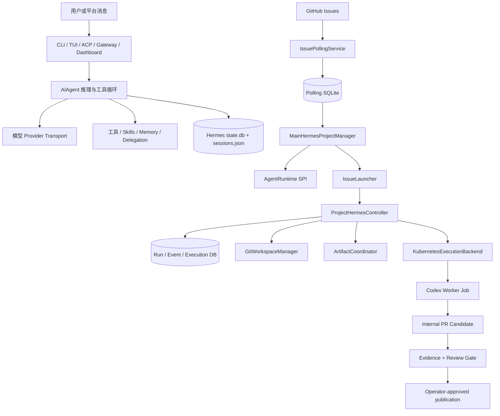
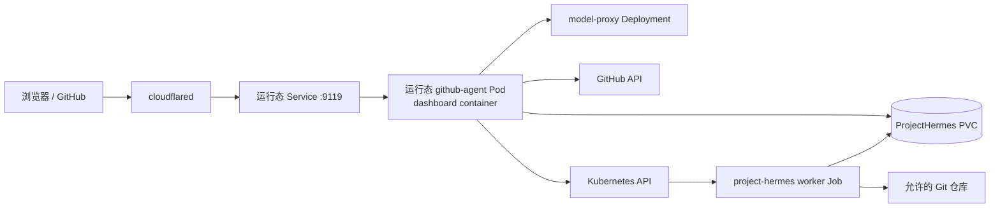
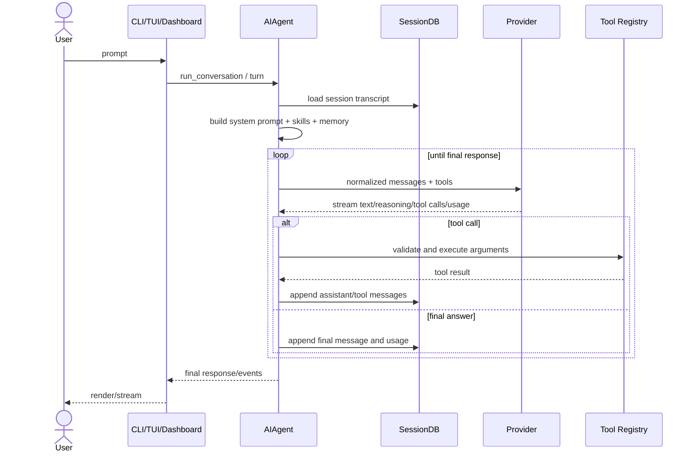
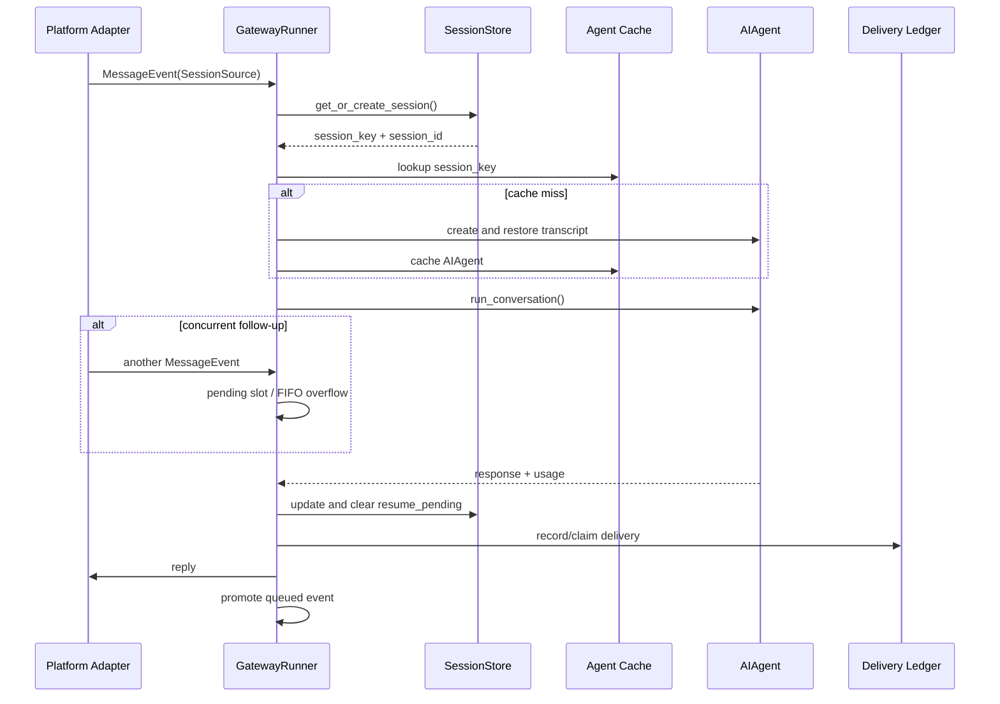
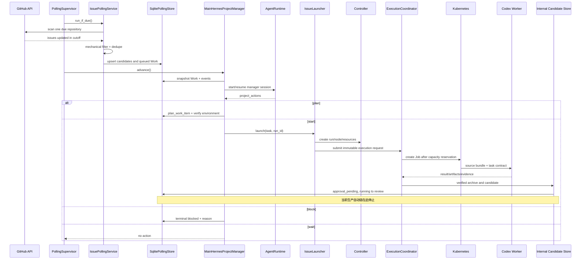
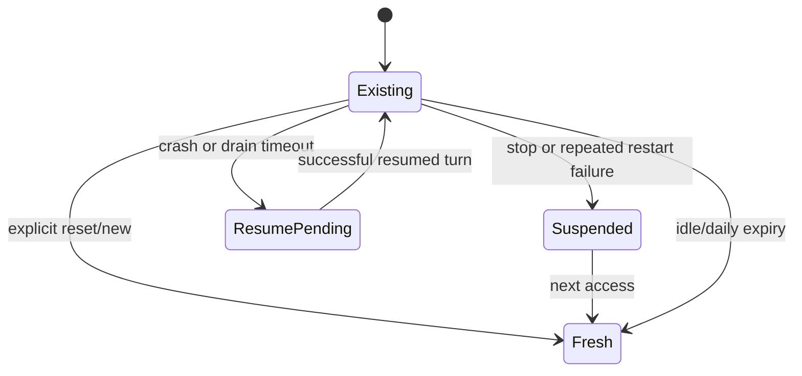
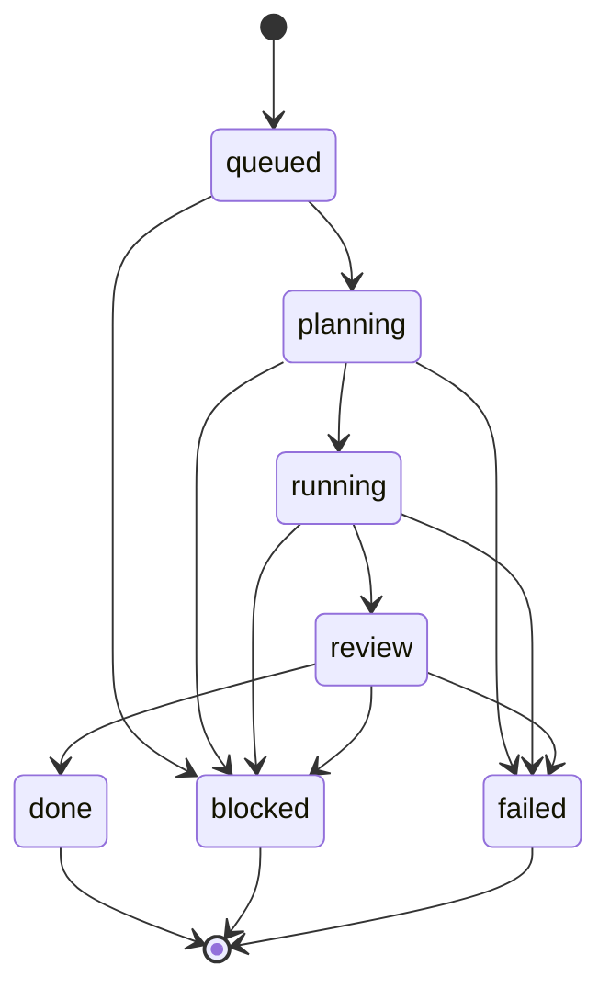
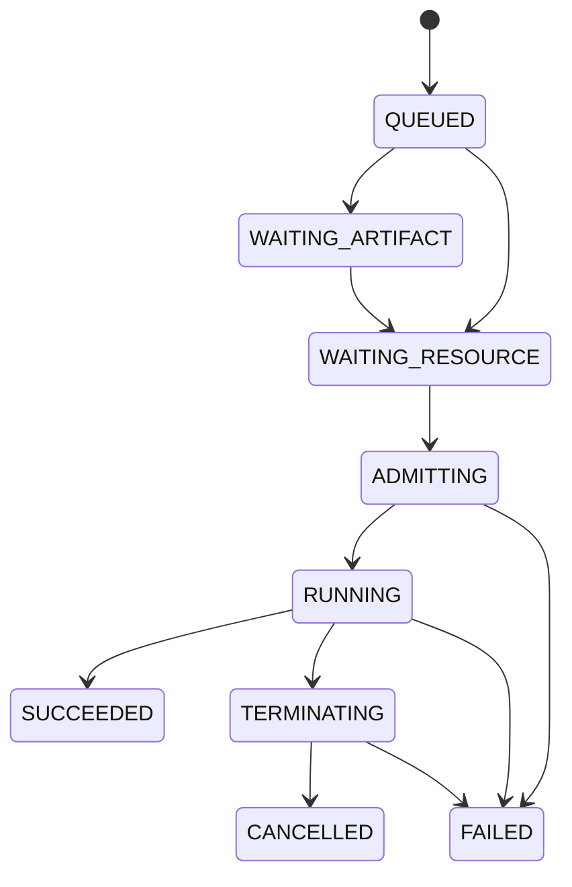

# Hermes Agent + ProjectHermes 详细设计（Detailed Design）

> 文档状态：基于代码与运行态证据的现状设计  
> 基线日期：2026-08-17  
> 上游 Hermes 版本：`0.20.0`  
> Git 基线：detached HEAD `9829746dfe3d5077f4f076e257505ec7f8feaa65`  
> ProjectHermes 形态：当前工作树上的 additive（叠加式）扩展  
> 读者：实现者、Reviewer、平台工程师、SRE、安全审计与发布负责人

## 0. 文档约定

本文以当前 checkout、已有 ProjectHermes 文档和已观测的 Kubernetes 运行态为事实来源。文中使用以下标签，避免把设计意图误写为线上能力：

- **[已实现]**：当前工作树中存在可执行代码或测试；
- **[已部署]**：已在目标 Kubernetes 环境中观察到；
- **[发布漂移]**：当前工作树与线上 immutable release 不一致；
- **[缺口]**：类型、存储或测试存在，但生产调用链不闭合；
- **[建议]**：推荐演进，不代表当前能力。

当前 Git 基线是 detached HEAD；`project_hermes/`、`docs/project-hermes/`、`deploy/` 等 ProjectHermes 文件在该基线上表现为未跟踪叠加层。因此，“上游 Hermes”与“ProjectHermes 扩展”不仅是逻辑边界，也是当前工作树中的来源边界。本文不将未跟踪状态等同于未实现，但 release 构建必须显式纳入这些文件并校验产物。

## 1. 范围、目标与事实基线

### 1.1 系统目标

Hermes Agent 是通用、可持续会话的 AI Agent 运行时：负责模型调用、工具循环、技能、记忆、会话压缩、子任务委派、多消息平台接入以及 Dashboard 交互。

ProjectHermes 是不修改 Hermes 推理内核语义的外部控制面：负责从 GitHub Issue 发现工作，约束任务合同，调度隔离 worker，持久化事件与资源所有权，收集证据，执行独立评审和发布门禁。其核心原则是：

1. 模型决定“下一步技术动作”，但不直接拥有外部副作用权限；
2. Controller 验证权限、资源、幂等和状态转移；
3. 事实、证据、评审和发布对象按 digest 绑定；
4. worker 输入固定、输出可验证，失败可恢复；
5. 发布使用不可变、带校验和的 release，而不是集群内 mutable checkout。

### 1.2 非目标

- 不把 ProjectHermes 写成 Hermes 上游必需组件；
- 不声称当前已实现 ADP/企业 SSO；Dashboard 实际使用 OAuth/Nous gate、loopback token 和 WebSocket ticket；
- 不把 `LOCATE → REPRODUCE → PLAN → IMPLEMENT` 固化成控制面生命周期；它们是 Agent 可选择的 capability；
- 不声称 PostgreSQL、对象存储和多副本 Controller 已全部投产；
- 不声称当前生产链路已能完成 candidate 人工批准；该闭环目前缺失；
- 不把测试中可调用的对象方法等同于 API/UI 可操作能力。

### 1.3 技术栈与主要入口

| 层 | 技术 | 主要入口 |
|---|---|---|
| Hermes 核心 | Python `>=3.11,<3.14`、asyncio、Pydantic | `run_agent.py`、`agent/` |
| CLI | Typer/命令分发 | `hermes_cli/main.py`、`hermes_cli/commands.py` |
| Gateway | Python asyncio、多平台 adapter | `gateway/run.py`、`gateway/session.py` |
| Dashboard API | FastAPI、WebSocket、SSE | `hermes_cli/web_server.py` |
| Dashboard Web | React、TypeScript、Vite | `web/src/` |
| Hermes 持久化 | SQLite、WAL、FTS5 | `hermes_state.py`、`hermes_state_common.py` |
| ProjectHermes | Python、Pydantic、SQLite/Postgres adapter | `project_hermes/` |
| Worker | Codex SDK/CLI `0.144.4`、Kubernetes Job | `project_hermes/runtime/`、`project_hermes/execution.py` |
| 发布 | Python 打包脚本、wheelhouse、SHA-256 | `scripts/package_project_hermes_release.py` |
| 集群 | Kubernetes Deployment/Job/PVC/RBAC | `deploy/kubernetes/` |

事实来源包括：

- `PROJECT_HERMES.md`：扩展总览；
- `pyproject.toml`：版本、依赖和可选 `project-hermes` extra；
- `docs/project-hermes/{architecture,contracts,security,operations,release}.md`；
- `project_hermes/`、`hermes_cli/web_server.py`、`gateway/`、`agent/`；
- `deploy/kubernetes/`；
- 线上 Pod、release 文件 hash 和 SQLite 事件/投影的只读检查。

## 2. 系统与进程拓扑

### 2.1 逻辑总览



Hermes 的 Agent loop 是“内循环”：根据上下文观察、调用模型、执行工具并修订计划。ProjectHermes Controller 是“外循环”：把请求视为不可信输入，检查合同和资源，再记录事件和推进状态。

### 2.2 进程边界

1. **CLI/TUI/ACP 进程**
   - 直接创建或适配 Hermes Agent；
   - 维护当前交互会话；
   - 不自动启动 ProjectHermes supervisor。
2. **Gateway 进程**
   - 启动多个消息平台 adapter；
   - `GatewayRunner` 管理路由、session key、Agent cache、消息队列、恢复与过期；
   - 每个会话复用或重建 `AIAgent`。
3. **Dashboard 进程**
   - `hermes_cli.web_server` 创建 FastAPI app；
   - 提供 `/api/*`、WebSocket、SSE、静态 SPA；
   - 模块加载时调用 `_mount_project_hermes_routes()`；
   - lifespan 启停 `PollingSupervisor`。
4. **ProjectHermes 主控制进程**
   - 当前与 Dashboard 同进程装配；
   - supervisor 内并行运行 polling loop 与 manager loop；
   - SQLite adapter 面向单 Controller；多副本会造成重复 supervisor 和不安全争抢。
5. **Codex task daemon**
   - 每个 task 一个 daemon、一个 root thread；
   - controller 通过私有 Unix socket 发短连接命令；
   - daemon 使用官方 `openai-codex` 与固定 CLI；
   - 私有目录为 `0700`，元数据为 `0600`。
6. **Kubernetes worker Job**
   - 从 checksum-verified source bundle 启动；
   - 获取确定的 task/执行输入；
   - 在分配的资源限制、GPU 和网络策略内运行；
   - 产生日志、结果、artifact 和 candidate 证据。

### 2.3 已观察运行态与当前发布清单



先前对目标集群的只读检查观察到一个包含 `dashboard` 与 `cloudflared` 的 `github-agent` 运行单元，Dashboard 监听 `9119` 并经 Service/tunnel 暴露；`PROJECT_HERMES_CONFIG` 指向 release 内的 `config/project-hermes.cluster.yaml`。这是**当时运行态**，不是当前 checkout 清单承诺的拓扑。

当前 checkout 的 immutable-release 清单已经不同：

- `deploy/kubernetes/github-agent-pod.yaml` 是单容器裸 Pod，而不是 Deployment；
- Dashboard 仅绑定 `127.0.0.1:8770`；
- 不创建 Dashboard Service，不包含 `cloudflared`；
- 只允许 `kubectl port-forward pod/github-agent 8770:8770`；
- Pod 直接挂载版本化 release 子路径并在启动时验证 digest；
- `project-hermes-controller` ServiceAccount 具有 worker Job 管理权限；
- worker 资源模板可请求 `amd.com/gpu`。

因此，发布切换必须把“旧运行态 9119+tunnel”迁移为“当前清单 8770+loopback”，不能只替换 Python 文件。安全评审也不能把旧 tunnel 暴露方式当成新 release 的设计。

生产启动使用 release 目录，不应从 PVC checkout 动态 `pip install`。release 中至少包含 source tarball、wheelhouse、配置/manifest、worker runtime 和 checksums。

### 2.4 部署单元约束

- 当前 Dashboard 与 supervisor 绑定，扩缩容 Dashboard 会同时扩缩容 Controller loop；
- SQLite、Unix socket 和 task-private runtime 使当前实现天然偏向单主、单宿主；
- 多副本前需拆分 web 与 controller leader，或引入租约/leader election；
- worker 可以水平并行，但全局 Job/GPU 额度由 execution store 原子预留；
- REVIEW 状态在当前 Work 容量统计中与 RUNNING 一样占 lane。

## 3. 模块级设计

### 3.1 Hermes 入口与 Agent 内核

| 文件/目录 | 关键对象 | 责任 |
|---|---|---|
| `run_agent.py` | 交互入口 | 解析模型/会话参数，创建 Agent 并运行 turn |
| `agent/` | `AIAgent` 及辅助模块 | system prompt、模型循环、工具执行、压缩、计费与错误恢复 |
| `agent/model_metadata.py` 等 | provider/model 解析 | 将用户模型选择解析为 transport 配置 |
| `tools/` | tool registry 与实现 | 文件、Shell、浏览器、委派、任务等能力 |
| `skills/`、`optional-skills/` | Skill 加载 | 按环境和请求注入专用指令 |
| `memory/`、`plugins/memory/` | memory provider | 检索和持久化长期知识 |
| `hermes_state.py` | `SessionDB` | 会话、消息、FTS、计费、路由和恢复 |
| `hermes_state_common.py` | schema/migration 常量 | SQLite DDL、FTS trigger 和共享数据结构 |

Agent 的基本不变量：

1. 模型输出只有经 parser/transport 正常化后才能进入工具分发；
2. 工具结果作为消息追加到同一 turn，直到生成最终回答或达到停止条件；
3. live transcript 与 SQLite 持久化有明确 flush 边界；
4. 压缩创建新会话边界/摘要，而不是无审计地覆写全部历史；
5. provider 特有 reasoning、tool-call 和 token 字段保留在统一消息模型中。

### 3.2 Provider transport

Provider 层负责：

- 模型名与 provider 路由；
- Chat/Responses 类 wire API 适配；
- streaming delta 标准化；
- tool call 参数拼装；
- usage、reasoning token 和 cache token 统计；
- 限流、超时、可重试错误和不可重试错误分类；
- API endpoint/key 环境变量解析。

ProjectHermes 不重写该层。`HermesRuntimeAdapter` 接受上游 Agent factory，把 provider、prompt、plugin、skill、memory 与 delegation 所有权留在 Hermes；`CodexTaskRuntimeAdapter` 则通过官方 Codex SDK/CLI 运行 task-private thread。

### 3.3 Gateway

| 文件 | 关键对象 | 责任 |
|---|---|---|
| `gateway/run.py` | `GatewayRunner` | adapter 生命周期、消息处理、Agent cache、排队、恢复 |
| `gateway/session.py` | `SessionSource`、`SessionEntry`、`SessionStore` | 会话键、重置策略、元数据与 transcript |
| `gateway/config.py` | `GatewayConfig` | 平台、会话隔离和过期策略 |
| `gateway/platforms/` | 平台 adapter | Telegram/Discord/Slack/Signal/WhatsApp/Matrix 等输入输出 |
| `gateway/agent_cache_pressure.py` | 内存压力回收 | 依据 cgroup/RSS 清理 LRU Agent |
| `gateway/delivery_ledger.py` | delivery obligation | 异步结果投递去重和恢复 |

`build_session_key()` 按 platform/chat/thread/user 形成会话 lane。DM 默认私有；group 默认按用户隔离；thread 默认共享，可由配置改变。`SessionStore` 用 `sessions.json` 保存快速路由元数据，以 SQLite 为 canonical transcript。

### 3.4 Dashboard

| 文件 | 责任 |
|---|---|
| `hermes_cli/web_server.py` | FastAPI app、认证、REST、WS、SSE、SPA、lifespan |
| `hermes_cli/web_git.py` | Git/项目视图相关 API |
| `web/src/App.tsx` | React route 与页面装配 |
| `web/src/pages/ChatPage.tsx` | Dashboard 会话/流式聊天 |
| `web/src/pages/WorkPage.tsx` | ProjectHermes Work 列表（当前只读） |
| `web/src/pages/IssuesPage.tsx` | polling/issue 视图 |
| `web/src/pages/ChangesPage.tsx` | candidate/diff 视图 |
| `web/src/lib/api.ts` | API client 与 auth 处理 |

Dashboard 可同时服务普通 Hermes 聊天和 ProjectHermes 投影。`web_integration.mount_project_hermes()` 在配置存在时构造 store、controller、runtime、launcher、manager、supervisor 和 router，并将 `ProjectHermesWebServices` 放入 `app.state`。

### 3.5 ProjectHermes discovery 与项目管理

| 文件 | 关键对象 | 责任 |
|---|---|---|
| `project_hermes/config.py` | `ProjectHermesConfig`、`load_config()` | 严格配置、路径、版本、凭据和 K8s 资源验证 |
| `project_hermes/polling.py` | `IssuePollingService` | 有界扫描、过滤、去重、入队 |
| `project_hermes/polling_store.py` | `SqlitePollingStore` | polling、candidate、Work、manager state |
| `project_hermes/polling_supervisor.py` | `PollingSupervisor` | polling loop 和 manager loop |
| `project_hermes/project_manager.py` | `MainHermesProjectManager` | 构造 snapshot、调用 LLM、分发 plan/start/block/wait |
| `project_hermes/AGENT.md` | manager immutable instructions | 决策格式与优先级合同 |
| `project_hermes/issue_launcher.py` | `IssueLauncher` | task → source bundle → execution |

`MainHermesProjectManager` 不是直接执行器。它将当前 Work 投影和事件发给 `AgentRuntime`，解析结构化 `project_actions`，再调用 store/launcher。动作只有：

- `plan`：锁定计划、环境和资源要求；
- `start`：从已提交计划创建运行/执行；
- `block`：以可审计原因终止；
- `wait`：当前不推进。

### 3.6 控制面、资源与执行

| 文件 | 关键对象 | 责任 |
|---|---|---|
| `project_hermes/controller.py` | `ProjectHermesController` | action authorization、run/node/evidence/review 门禁 |
| `project_hermes/policy.py` | `PolicyEngine` | role/action/task/permission 检查 |
| `project_hermes/work_graph.py` | `PipelineRun`、`WorkGraph`、`WorkNode` | 动态 DAG 与粗粒度 lifecycle |
| `project_hermes/store.py` | `SqliteRunStore` | run/node/event、claim lease、CAS |
| `project_hermes/postgres_store.py` | Postgres store | 控制面 durable store adapter |
| `project_hermes/workspaces.py` | `GitWorkspaceManager` | mirror、baseline、exclusive worktree、candidate digest |
| `project_hermes/artifacts.py` | `ArtifactCoordinator` | staging、SHA-256 验证、content-addressed artifact |
| `project_hermes/resource_managers.py` | `GpuPool` | all-or-nothing GPU lease |
| `project_hermes/execution.py` | execution coordinator/store/backend | 幂等执行、全局容量、终止确认 |
| `project_hermes/kubernetes_jobs.py` | `KubernetesJobBackend` | 创建、观察、取消 Job |

### 3.7 Runtime SPI

`project_hermes/runtime/base.py` 的 `AgentRuntime` 抽象提供：

- `start(request)`：建立 durable native identity 并执行首 turn；
- `resume(handle, request)`：在相同 native session 上继续；
- `reconnect(handle)`：恢复 adapter 状态但不运行 turn；
- `cancel(handle)`：请求中断；
- `events(handle, after_sequence)`：读取标准化事件；
- `result(handle)`：读取最新 turn 结果；
- `close(handle)`：释放 live 资源，不删除 identity。

`project_hermes/runtime/codex_daemon.py` 与 supervisor 之间使用 `codex-command.v1` / `codex-reply.v1`。task spec 在 daemon 存活期间不可变；model、endpoint、credential、network 或版本变化必须停机重建。

### 3.8 Evidence、review、publication 与 knowledge

| 文件 | 责任 |
|---|---|
| `project_hermes/assurance.py` | evidence record、completion matrix、review packet/gate |
| `project_hermes/assurance_store.py` | evidence/review/packet/resolution 持久化 |
| `project_hermes/publication.py` | internal PR candidate、lock/check/comparison |
| `project_hermes/knowledge.py` | 成功/失败知识候选、commit、probe、cleanup plan 与 tombstone |

closure 需要：

1. 任务要求的 completion layer 均有与当前 candidate/goal revision 绑定的证据；
2. completion auditor 与 minimal-diff reviewer 使用不同、非 implementer session；
3. 两者批准同一 review packet digest；
4. operator 明确批准 publication；
5. knowledge 已验证、提交并 probe；
6. cleanup path 再次验证后才能删除 task-private state。

当前生产调用链未完成第 4 步对应的 candidate immutable approval，详见第 10 节。

## 4. 端到端调用链与时序

### 4.1 交互式 Hermes turn



错误边界：

- provider 429/5xx 由 transport/调用层按分类退避，不应由上层 tight loop 无限重发；
- tool 参数错误转为可见 tool result，由 Agent 修正；
- transcript 写失败不能假装 turn 已持久化；
- 压缩失败有 cooldown/fallback 计数，避免每个 turn 重复失败。

### 4.2 Gateway 消息 turn



### 4.3 Dashboard chat

浏览器先完成 OAuth/Nous gate 或本机 token 认证，随后：

1. REST 建立/查询会话和历史；
2. 为 WebSocket 获取短期 ticket；
3. 浏览器携 ticket 升级连接；
4. server 创建或恢复 Agent turn；
5. token、tool、status 事件经 WebSocket/SSE 输出；
6.最终消息、usage 和 session metadata 写入 SQLite；
7. orphan connection 由 server 回收并记录 end reason。

浏览器不得将长期 OAuth secret 放在 WebSocket query 中；ticket 是一次性/短期能力。

### 4.4 GitHub Issue → plan → worker → candidate → review



独立 reviewer、`immutable_approved`、Work `review → done` 和外部 GitHub PR publication 是合同中的目标路径，但当前 production composition 未接通，不能从上图推断为已实现自动闭环。

### 4.5 Polling 调度

每次 discovery run 只扫描一个当前到期 repository，避免单库故障或长列表阻塞所有仓库。完成 registry pass 后根据最旧 `last_scanned_at` 计算下次到期。pending Work buffer 满时 polling 暂停入队。

`PollingSupervisor` 启动两个 asyncio task：

- `_run_polling()` 周期调用 `IssuePollingService.run_if_due()`；
- `_run_manager()` 周期调用 `MainHermesProjectManager.advance()`。

这两个 loop 必须分别拥有：

- action 成功后的短间隔；
- 无变化/无可执行动作后的正常 idle backoff；
- provider 429/临时错误后的指数退避和 jitter；
- 配置/合同错误后的熔断与可观察状态。

当前 manager loop 对返回值语义的处理不满足以上要求，是线上自旋根因之一。

## 5. 状态与持久化

### 5.1 Hermes state.db

Hermes canonical SQLite schema 位于 `hermes_state_common.py`，核心表如下。

```sql
CREATE TABLE sessions (
  id TEXT PRIMARY KEY,
  source TEXT NOT NULL,
  session_key TEXT,
  model TEXT,
  system_prompt_hash TEXT,
  parent_session_id TEXT,
  started_at REAL NOT NULL,
  ended_at REAL,
  end_reason TEXT,
  message_count INTEGER DEFAULT 0,
  tool_call_count INTEGER DEFAULT 0,
  input_tokens INTEGER DEFAULT 0,
  output_tokens INTEGER DEFAULT 0,
  cache_read_tokens INTEGER DEFAULT 0,
  cache_write_tokens INTEGER DEFAULT 0,
  reasoning_tokens INTEGER DEFAULT 0,
  estimated_cost_usd REAL,
  actual_cost_usd REAL,
  expiry_finalized INTEGER DEFAULT 0,
  archived INTEGER NOT NULL DEFAULT 0,
  pinned INTEGER NOT NULL DEFAULT 0,
  FOREIGN KEY (parent_session_id) REFERENCES sessions(id)
);

CREATE TABLE messages (
  id INTEGER PRIMARY KEY AUTOINCREMENT,
  session_id TEXT NOT NULL REFERENCES sessions(id),
  role TEXT NOT NULL,
  content TEXT,
  tool_call_id TEXT,
  tool_calls TEXT,
  tool_name TEXT,
  effect_disposition TEXT,
  timestamp REAL NOT NULL,
  token_count INTEGER,
  finish_reason TEXT,
  reasoning TEXT,
  reasoning_details TEXT,
  observed INTEGER DEFAULT 0,
  active INTEGER NOT NULL DEFAULT 1,
  compacted INTEGER NOT NULL DEFAULT 0
);
```

其他关键表：

- `system_prompts`：按 hash 去重 system prompt；
- `session_model_usage`：按 session/model/provider/task 聚合 token 和费用；
- `gateway_routing`：持久化 session_key 路由；
- `compression_locks`：带 holder/expiry 的压缩互斥；
- `async_delegations`：异步委派状态、结果、投递 claim；
- FTS5 虚表及 insert/update/delete trigger：消息全文检索；
- `state_meta`：schema/迁移和状态键值。

SQLite 使用 WAL 和迁移逻辑。`messages.active=0` 支持 rewind 的软删除；`compacted` 区分已压缩消息。写 transcript 和更新 session usage 不能跨数据库假设全局事务。

当前主 schema version 为 `25`。常规写操作由 `SessionDB._execute_write()` 使用进程内锁与 `BEGIN IMMEDIATE` 包围，并对 `locked/busy` 抖动退避。默认尝试 WAL；不支持 WAL 或命中已知风险的文件系统可退化为 DELETE journal。FTS5 存储布局有独立版本，旧布局迁移需要显式存储优化，不能仅凭主 schema version 判断检索层已升级。

### 5.2 Gateway 辅助状态

`sessions.json` 保存 `session_key → SessionEntry` 快速映射、重置/恢复 flag 和 token summary；SQLite 是 transcript 与历史会话的 canonical store。JSON 使用临时文件加原子替换。SQLite 不可用时存在 legacy JSONL 降级路径，但运维不应把降级存储当作等价高可用。

Session flag 优先级：



### 5.3 Polling、Work 与 manager state

`project_hermes/polling_store.py` 在一个 SQLite 库中维护：

```sql
CREATE TABLE polling_candidates (
  candidate_id TEXT PRIMARY KEY,
  repository_id INTEGER NOT NULL,
  repository TEXT NOT NULL COLLATE NOCASE,
  issue_number INTEGER NOT NULL,
  issue_url TEXT NOT NULL,
  title TEXT NOT NULL,
  body TEXT NOT NULL,
  labels_json TEXT NOT NULL,
  evidence_score INTEGER NOT NULL,
  eligible INTEGER NOT NULL,
  filter_reasons_json TEXT NOT NULL,
  first_seen_at TEXT NOT NULL,
  last_seen_at TEXT NOT NULL,
  latest_run_id TEXT NOT NULL,
  UNIQUE(repository_id, issue_number)
);

CREATE TABLE work_items (
  work_item_id TEXT PRIMARY KEY,
  candidate_id TEXT NOT NULL UNIQUE,
  repository TEXT NOT NULL COLLATE NOCASE,
  issue_number INTEGER NOT NULL,
  status TEXT NOT NULL,
  current_step TEXT NOT NULL,
  plan_json TEXT,
  environment_status TEXT NOT NULL DEFAULT 'pending',
  named_baseline TEXT,
  resource_requirements_json TEXT,
  task_id TEXT,
  run_id TEXT,
  execution_id TEXT,
  internal_candidate_id TEXT,
  blocked_reason TEXT,
  last_error TEXT,
  queued_at TEXT NOT NULL,
  planning_started_at TEXT,
  started_at TEXT,
  review_started_at TEXT,
  completed_at TEXT,
  updated_at TEXT NOT NULL
);

CREATE TABLE work_events (
  sequence INTEGER PRIMARY KEY AUTOINCREMENT,
  event_id TEXT NOT NULL UNIQUE,
  work_item_id TEXT,
  event_type TEXT NOT NULL,
  payload_json TEXT NOT NULL,
  created_at TEXT NOT NULL
);

CREATE TABLE project_manager_state (
  manager_id TEXT PRIMARY KEY,
  session_id TEXT NOT NULL,
  handle_json TEXT NOT NULL,
  instructions_digest TEXT NOT NULL,
  snapshot_digest TEXT,
  last_event_sequence INTEGER NOT NULL,
  last_turn_at TEXT,
  last_error TEXT,
  version INTEGER NOT NULL,
  created_at TEXT NOT NULL,
  updated_at TEXT NOT NULL
);
```

同库还包含 `polling_tasks`、`polling_repositories`、`polling_runs` 和 `polling_run_repositories`。`work_events` 是追加历史，`work_items` 是查询投影；二者都应保留以便重建和诊断。

默认完整装配会使用多个独立持久化对象，例如 `.project-hermes/polling.db`、`.project-hermes/control-plane.db`、`.project-hermes/runtime-bindings.db`、`.project-hermes/artifact-registry.db` 以及 workspace/source/archive 文件目录。即使多个 Store 最终指向同一个 SQLite 文件，它们仍以不同连接和事务提交，不存在跨 Store 的统一事务。

Work 状态机：



环境状态独立为 `pending → verified | failed`。只有已提交计划和已验证环境的 work 才应 `start`。`done/blocked/failed` 当前为终态，没有 production retry transition；恢复必须创建新身份或新增受控重试合同。

### 5.4 控制面 run、node 与 event

```sql
CREATE TABLE project_hermes_runs (
  run_id TEXT PRIMARY KEY,
  task_id TEXT NOT NULL,
  status TEXT NOT NULL,
  goal_revision INTEGER NOT NULL,
  task_json TEXT NOT NULL,
  created_at TEXT NOT NULL,
  updated_at TEXT NOT NULL,
  completed_at TEXT
);

CREATE TABLE project_hermes_nodes (
  node_id TEXT PRIMARY KEY,
  run_id TEXT NOT NULL REFERENCES project_hermes_runs(run_id),
  status TEXT NOT NULL,
  requested_role TEXT NOT NULL,
  idempotency_key TEXT,
  owner_token TEXT,
  lease_expires_at TEXT,
  node_json TEXT NOT NULL,
  created_at TEXT NOT NULL,
  updated_at TEXT NOT NULL
);

CREATE TABLE project_hermes_events (
  event_id TEXT PRIMARY KEY,
  run_id TEXT NOT NULL REFERENCES project_hermes_runs(run_id),
  node_id TEXT,
  session_id TEXT,
  sequence INTEGER NOT NULL,
  event_type TEXT NOT NULL,
  payload_json TEXT NOT NULL,
  created_at TEXT NOT NULL,
  UNIQUE(run_id, sequence)
);
```

node claim 在 `BEGIN IMMEDIATE` 中用 owner token、expiry 和 CAS 更新。ready 条件是状态为 QUEUED 且依赖全部完成。过期 claim 被 requeue，并追加事件。

Lifecycle 状态：

```text
DISCOVERED → QUEUED → CLAIMED → RUNNING
RUNNING/QUEUED → WAITING_RESOURCE | WAITING_ARTIFACT | WAITING_REVIEW | WAITING_APPROVAL
任意允许状态 → COMPLETED | BLOCKED | FAILED | CANCELLED
```

技术 capability 可重复、并行或跳过，不映射为强制 lifecycle stage。

### 5.5 Execution

```sql
CREATE TABLE project_hermes_executions (
  execution_id TEXT PRIMARY KEY,
  request_id TEXT NOT NULL UNIQUE,
  task_id TEXT NOT NULL,
  node_id TEXT NOT NULL,
  status TEXT NOT NULL,
  idempotency_key TEXT NOT NULL,
  version INTEGER NOT NULL,
  record_json TEXT NOT NULL,
  updated_at TEXT NOT NULL,
  UNIQUE(task_id, idempotency_key)
);
```

状态机：



Execution store 用 `version` 做 compare-and-set；`(task_id,idempotency_key)` 防重复逻辑执行。复用相同 key 但输入不同会失败。GPU lease 只能在外部 Job/Pod 已确认终止后释放，不能仅因 timeout 回收。

### 5.6 Runtime

`RuntimeStatus`：

```text
STARTING → IDLE → RUNNING → IDLE
RUNNING → COMPLETED | FAILED | CANCELLED
任意允许状态 → CLOSED
```

runtime binding 保留 task 到 native session/thread 的映射。Codex `session.json` 是 restart identity；daemon 重启应 resume 原 root thread，而不是创建替代 thread。

### 5.7 Candidate、assurance 与 knowledge

Candidate 投影：

```sql
CREATE TABLE project_hermes_internal_pr_candidates (
  candidate_id TEXT PRIMARY KEY,
  task_id TEXT NOT NULL,
  repository TEXT NOT NULL,
  lock_state TEXT NOT NULL,
  candidate_json TEXT NOT NULL,
  created_at TEXT NOT NULL,
  updated_at TEXT NOT NULL
);
```

锁状态只能单向：

```text
draft → approval_pending → immutable_approved
```

`immutable_copy(approved_by, approved_at)` 返回新 immutable object，不原地修改。store 拒绝锁状态倒退和同 ID 内容冲突。

Assurance store 分表持久化：

- `project_hermes_evidence`；
- `project_hermes_completion`；
- `project_hermes_reviews`；
- `project_hermes_review_packets`；
- `project_hermes_review_resolutions`；
- `project_hermes_review_escalations`；
- `project_hermes_candidate_locks`。

证据 ID 不可覆写；candidate digest 变化必须 invalidate stale completion 和 review。knowledge commit 成功后还要按 digest probe，才可进入 cleanup。

### 5.8 事务、一致性和所有权边界

| 边界 | 当前机制 | 保证 | 不保证 |
|---|---|---|---|
| Hermes transcript | SQLite transaction/WAL | 单库消息与 usage 原子性 | 与 Gateway JSON、外部发送的全局事务 |
| Work 投影 | `RLock` + SQLite transaction | 单进程串行写 | 多主共识 |
| Manager state | `version` CAS | 防旧 snapshot 覆盖 | 模型动作幂等自动成立 |
| WorkGraph claim | `BEGIN IMMEDIATE` + owner/expiry | 单库原子 claim | 跨数据库资源原子性 |
| Execution | version CAS + idempotency key | 重放相同请求 | 外部 K8s create 与 DB 的 2PC |
| Artifact | digest + atomic move | 字节身份 | 来源可信度 |
| Workspace | exclusive lease + owner session | write scope 与 owner | 远端仓库不可变 |
| GPU | lease + termination confirmation | 不超卖和不提前释放 | backend 隔离正确性证明 |
| Candidate | digest + monotonic lock | 审查对象不变 | 当前 operator UI/API 闭环 |

`GpuPool` 是当前 Controller 进程内对象，不是跨进程分布式 allocator。SQLite execution capacity reservation 只在共享同一 Store、单 Controller 的约束下成立；不能据此声称多副本具备严格 GPU 排他性。完整生产 wiring 目前也仍要求 SQLite execution/artifact/runtime-binding adapter；PostgreSQL 只覆盖部分 run/assurance store，`ControlPlaneMode.HTTP` 尚无完整 adapter。

## 6. API 与协议

### 6.1 ProjectHermes REST

`project_hermes/api.py` 构造 prefix `/v2/project-hermes` 的 router；挂载到 Dashboard `/api` 后，对外路径为 `/api/v2/project-hermes/*`。

| 方法与路径 | 责任 | 副作用 |
|---|---|---|
| `GET /polling` | polling task/overview | 无 |
| `POST /polling/run` | 请求一次有界扫描 | 有 |
| `GET /polling/runs` | polling run 列表 | 无 |
| `GET /polling/runs/{run_id}/repositories` | 每仓库扫描结果 | 无 |
| `GET /polling/repositories` | repository registry | 无 |
| `GET /polling/candidates` | filtered candidates | 无 |
| `GET /issues` | issue 投影视图 | 无 |
| `GET /issues/{candidate_id}` | issue 详情 | 无 |
| `GET /work-items` | Work 列表与计数 | 无 |
| `GET /work-items/{work_item_id}` | Work 详情/事件 | 无 |
| `POST /runs` | 创建 controller run | 有 |
| `GET /runs/{run_id}` | run + graph | 无 |
| `GET /runs/{run_id}/events` | append-only events | 无 |
| `GET /tasks/{task_id}/accounting` | 资源/模型记账 | 无 |
| `GET /pull-request-candidates` | internal candidates | 无 |
| `GET /pull-request-candidates/{candidate_id}` | candidate 详情 | 无 |
| `GET /pull-request-candidates/{candidate_id}/files/diff` | 冻结 diff | 无 |
| `POST /runs/{run_id}/actions` | 提交受策略约束的 ActionRequest | 有 |
| `POST /runs/{run_id}/nodes/claim` | claim ready node | 有 |
| `POST /runs/{run_id}/nodes/{node_id}/transition` | CAS-like node transition | 有 |

明确缺失：

- 没有 `POST /work-items/{id}/start`；
- 没有 `POST /work-items/{id}/block`；
- 没有 `POST /work-items/{id}/retry`；
- 没有 candidate approve/immutable lock endpoint；
- `WorkPage.tsx` 没有对应 operator control。

因此不能通过 Dashboard 手动解除 plan→work 堵塞，也不能完成 production approval。

### 6.2 Dashboard REST/WS/SSE

Dashboard API 由 `hermes_cli/web_server.py` 统一提供，涵盖：

- session/chat 创建、历史和消息；
- model/provider/config 信息；
- projects、Git、files、terminal/command；
- dashboard status、usage 和 background operation；
- WebSocket 实时 turn、PTY、JSON-RPC 和事件；
- streaming HTTP response；
- ProjectHermes router。

主要 WebSocket 包括 `/api/pty`、`/api/ws`、`/api/pub`、`/api/events`、`/api/console` 和 `/api/audio/speak-stream`。其中 `/api/events` 虽然名称含 events，但它是 WebSocket，不是 SSE。

ProjectHermes 自身没有 WebSocket 或 SSE route；`GET /runs/{run_id}/events?after=N` 是带 sequence cursor 的 REST 轮询。不要把 Dashboard 的通用 WebSocket 广播或 Gateway API 的 SSE 写成 ProjectHermes durable push。

独立 Messaging Gateway API（`gateway/platforms/api_server.py`）提供 OpenAI-compatible `/v1/chat/completions`、`/v1/responses`、session chat 和 `/v1/runs/{run_id}/events` SSE。该 `/v1/runs` 状态与 subscriber queue 仅在进程内存中，不是 ProjectHermes 的 durable event log，重启后不能断点恢复，也不是持久 fan-out 总线。

完整 route 清单应以运行中的 OpenAPI 为准：

```bash
curl -fsS http://127.0.0.1:8770/openapi.json
```

客户端不能根据内部 Python 函数名推断稳定 API。兼容性约束是 path、method、Pydantic schema、auth 和 event type。

### 6.3 外部合同版本

所有 ProjectHermes 外部模型继承 `StrictModel`：拒绝未知字段、assignment 时验证、strip string whitespace。主要 schema：

- `issue-task.v2`、`goal-revision.v1`；
- `pipeline-run.v2`、`work-graph.v1`、`work-node.v1`、`agent-event.v1`；
- `action-request.v1`；
- `runtime-request.v1`、`runtime-handle.v1`、`runtime-event.v1`、`runtime-result.v1`；
- `codex-task-spec.v1`、`codex-command.v1`、`codex-reply.v1`；
- `workspace-lease.v1`、`gpu-request.v1`、`gpu-lease.v1`；
- `artifact-request.v1`、`artifact-manifest.v1`、`resource-bundle.v1`；
- `evidence-record.v3`、`completion-matrix.v3`；
- `review-packet.v2`、`review-record.v3`、`review-gate.v3`；
- `candidate-gate-result.v3`；
- `knowledge-candidate.v1`、`knowledge-commit.v1`、`cleanup-tombstone.v2`。

版本规则：

1. 消费者拒绝未知 major；
2. 持久化和副作用前完成严格验证；
3. 保留原始已验证 record；
4. projection 可迁移，append-only event 不改写；
5. 字段改名、不变量或语义改变时升级 schema version。

### 6.4 issue-task 合同

锁定 task 至少绑定：

- task/campaign/issue URL；
- named baseline；
- 可独立验证的 goal path 和 acceptance criteria；
- repository responsibility 与依赖顺序；
- non-goal 和 must-preserve；
- target hardware；
- readable/writable repository；
- execution/review/publication/network 权限；
- task 资源上限；
- triage `APPROVE` 和 evidence refs；
- revision。

Agent 不能静默扩 scope。扩仓库或权限必须提交 `goal-revision.v1`，由 authority 决定后再更新 locked task。

### 6.5 Source bundle 与 artifact

`IssueLauncher` 使用 deterministic source bundle。执行身份至少绑定：

- task/run/node；
- baseline commit；
- repository/workspace lease；
- candidate digest；
- command argv；
- environment identity；
- artifact/source bundle SHA-256；
- idempotency key。

Artifact provider 只能把 regular file 写入私有 staging。`ArtifactCoordinator` 检查 resolved path 位于 staging 内、digest 等于 expected SHA-256，再 atomic move 到：

```text
ARTIFACT_ROOT/sha256/<prefix>/<full-digest>
```

消费者只接收 `artifact-manifest.v1`，不信任 provider 返回路径或 URI。

### 6.6 Worker 输入输出

Kubernetes worker 输入：

- checksum-verified release/runtime；
- locked task contract；
- source bundle manifest；
- baseline/candidate identity；
- controller 允许的 command/environment；
- credentials file mount（非配置内 secret）；
- CPU、内存、GPU、timeout 和 network policy。

worker 输出：

- normalized execution status；
- stdout/stderr 或其 immutable reference；
- exit code/structured result；
- artifact manifest；
- exact environment identity；
- candidate digest；
- evidence records；
- 必要时 internal PR candidate projection。

worker 不得：

- 自行申请额外 GPU；
- 绕过 controller 获取任意 artifact；
- 修改 lease 外 worktree；
- 自行 publish；
- 删除 task-private/control-plane state。

Source bundle 使用 `task-source-bundle.v1`，锁定 `task_id/repository/workspace_lease_id/base_sha/candidate_digest`。归档排除 `.git`，路径排序、tar metadata 归一化、gzip `mtime=0`，并按 SHA-256 内容寻址。Worker 的 `prepare-source.py` 再次拒绝绝对路径、`..`、重复路径、逃逸 symlink 和身份不一致。解包后建立的是合成 Git baseline；Worker 不持有原仓库的 `.git` 数据库。

成功候选的 `result.json` 必须满足 `project-hermes-worker-candidate.v1`，绑定 execution/task/repository/source digest、base/head、commit、files 和 checks。Wrapper 在 Worker 未生成结果时写入的 `{"exit_code": N}` 仅保证归档可完成，不符合 candidate schema，ingest 会拒绝它。`usage.json` 当前没有严格版本化 Pydantic schema，缺失数值按 0 处理，是协议缺口。

Worker archive 必须恰好提交 `stdout.log`、`stderr.log`、`result.json` 和 `usage.json` 的内容寻址对象。`worker-artifact-archive.v1` manifest 写入后，最后写 `complete` 文件作为提交标记；读取方重新校验 manifest digest、每个对象的大小和 SHA-256。只有 archive 已验证才允许删除 terminal Job。

## 7. 认证与安全

### 7.1 Dashboard 认证链

Dashboard 支持三类实际认证能力：

1. **OAuth/Nous gate**：远程浏览器访问的登录门；
2. **loopback token**：本机 CLI/浏览器 bootstrap；
3. **WebSocket ticket**：通过已认证 HTTP 获取的短期升级凭证。

ProjectHermes router 复用 Dashboard `authenticate` dependency，不单独维护用户体系。写操作还接收 `action_context`，用于 controller/operator 角色和审计身份。

当前 `mount_project_hermes.authenticate` 从 `X-Project-Hermes-Role` 和 `X-Project-Hermes-Session` 请求头构造 principal，role 缺省为 `operator`。代码只检查 role 是否属于 `ProjectRole` 枚举，未发现服务端“用户 → ProjectHermes 角色”映射或签名角色声明。因此现状是“Dashboard 已认证 + 客户端声明角色”，不是可信的多租户 RBAC；任何已认证调用者都可能尝试声明 `control_plane`。在补齐服务端授权前，ProjectHermes 写 API 只能放在单 operator、loopback/port-forward 的受控边界内。

当前 immutable Kubernetes 清单没有配置远程登录 provider：Dashboard 仅绑定 Pod loopback，预期通过 `kubectl port-forward` 访问。该部署依赖 Kubernetes API/RBAC 建立外层访问边界；如果改为非 loopback bind，`web_server.py` 会要求 OAuth 或 bundled password provider，不能通过 tunnel/Service 绕过 gate。

本文不声称存在 ADP SSO。若接入企业 SSO，应在 Dashboard authentication dependency 前做 OIDC/SAML identity translation，并保持：

- subject/tenant/role 显式映射；
- WebSocket ticket 由服务端签发；
- operator action 记录原始身份；
- ProjectHermes policy 仍进行 task/action 授权，而非只依赖“已登录”。

### 7.2 凭据文件合同

`validate_credentials_file()` 强制：

- 位于 `project_root`；
- regular file，非 symlink；
- owner 是当前用户；
- mode `0600` 或更严格；
- 小于 64 KiB；
- 不被 Git 跟踪；
- 顶层仅 `environment`；
- key 是 credential-shaped uppercase name；
- 拒绝 `PATH`、`HOME`、`PYTHONPATH`、`LD_PRELOAD`、`CODEX_HOME` 等进程控制变量。

Controller 不把 secret 写入 config fingerprint、daemon spec、Codex `config.toml`、event、evidence、review 或 argv。daemon 继承 allowlist 环境；proxy 变量默认不透传。

### 7.3 信任与权限边界

不可信输入包括模型输出、tool 参数、Issue/PR 文本、仓库内容、artifact provider 路径、runtime event、evidence claim、review prose、goal revision 和 cleanup path。

控制：

- `PolicyEngine` 按 role/action/task/permission fail closed；
- resolved path 检查 `..` 和 symlink escape；
- workspace write 需 exclusive lease 和 owner session；
- artifact 需 content digest；
- execution/network/publication 需 task permission；
- evidence 按 ID immutable；
- review session 与 implementer session 分离；
- cleanup 在 knowledge commit+probe 后执行；
- release image/artifact 使用 digest pin。

上述 `PolicyEngine` 控制以传入 principal 可信为前提；当前客户端声明 role 是其前置授权缺口。目标设计必须由服务端认证信息派生角色，并拒绝客户端提升权限。

### 7.4 Kubernetes 安全边界

- Controller 使用专用 ServiceAccount；
- RBAC 仅授予 worker Job 所需 verbs/resource；
- credentials 通过私有 mount，不进入 ConfigMap 和 release；
- worker 的 CPU/内存/GPU limit 写入 Job spec；
- GPU 仅通过 execution admission 分配；
- network policy 应按 task contract 默认拒绝；
- PVC 包含敏感 task state，需独立 identity、备份和 retention；
- `cloudflared` 是外部入口，不替代应用层认证。

残余风险：

- 同一 Unix 用户可绕过 mode `0600` 隔离；
- SQLite 无跨主共识和 row-level security；
- Python Controller 无法证明底层 CNI/device plugin 真正隔离；
- digest 证明字节一致，不证明供应者可信；
- session identity 形式上的 reviewer independence 不等价于组织上的独立性。

## 8. 运行、发布与部署

### 8.1 本地安装

上游开发环境：

```bash
uv sync
```

ProjectHermes 本地 adapter：

```bash
uv sync --extra project-hermes
uv run project-hermes init --config project-hermes.yaml
uv run project-hermes validate-config project-hermes.yaml
uv run project-hermes doctor project-hermes.yaml
```

`project-hermes` extra 固定 `openai-codex` 与 `openai-codex-cli-bin` 为 `0.144.4`。daemon 启动时再次验证 SDK/CLI 版本。

### 8.2 Dashboard/Web 联调

API 与 React 应分别启动，或先构建 SPA 再由 FastAPI 服务。验证点：

```bash
DASHBOARD_URL=http://127.0.0.1:8770
curl -fsS "${DASHBOARD_URL}/openapi.json" >/dev/null
curl -fsS "${DASHBOARD_URL}/api/v2/project-hermes/polling"
```

`8770` 是当前 Kubernetes release 清单端口；本地开发端口可由 CLI 参数改变。

前端构建必须使用真实 Node.js/npm。当前主机 PATH 中的 `node` 曾解析为 Bun shim，会导致 release/Web 构建不可信；需在发布前固定 Node toolchain。

### 8.3 Immutable release

构建命令以 `docs/project-hermes/release.md` 为准：

```bash
python scripts/package_project_hermes_release.py build \
  --runtime-image <image@sha256:digest> \
  --output-dir <release-dir>
```

构建器应：

1. 固定 source epoch；
2. 生成 source tarball；
3. 构建 wheels 与离线 wheelhouse；
4. 纳入共享 source tree、配置和 manifests；
5. 记录 runtime image digest；
6. 验证 Codex pins；
7. 生成并校验所有 SHA-256；
8. 验证 source/release shared-tree parity。

集群 installer 必须先校验 `RELEASE_DIGEST` 和 manifest，再离线安装 wheelhouse。禁止从 mutable checkout 补文件或在线解析依赖。

### 8.4 当前发布环境前置问题

已验证或需在发布前复核的本机构建障碍：

- `node` 是 Bun shim；
- UV cache 曾指向只读目录。

Python 版本本身不是已证实障碍：`pyproject.toml` 允许 `>=3.11,<3.14`，当前 packager 明确构建 Python 3.12 Linux wheel set；本地 `.venv` 为 3.12 与该目标兼容。发布环境应固定到 packager 声明的 3.12，而不是假定必须是 3.11。

Node/Bun 与 UV cache 问题不会直接解释 manager 逻辑错误，但会阻止把已修复源码可靠地打成新 release，属于恢复路径的技术前置条件。

### 8.5 Kubernetes 安装与验证

部署前：

1. 构建并离线验证 release；
2. 将配置中的 runtime image 改为 digest；
3. 校验 credential file/Secret mount；当前主流水线要求 `model-access-key`、`minimax-api-key` 与 `github-token`；
4. 渲染 manifests；
5. 审核 namespace、PVC、RBAC、ServiceAccount、resource limit 和 network policy；
6. 备份当前 SQLite 与 release metadata。

`github-agent-pod.yaml` 仍强制引用 `github-token`；模型密钥由 installer 以只读 Secret volume 读取并写入 owner-only credential file。实际安装前必须一次性校验上述 key，否则 Pod 或安装 Job 会因缺失 key 无法启动。

部署后：

```bash
kubectl -n project-hermes-jobs get pod/github-agent
kubectl -n project-hermes-jobs get jobs
kubectl -n project-hermes-jobs logs pod/github-agent -c github-agent
kubectl -n project-hermes-jobs port-forward pod/github-agent 8770:8770
```

应用级验证：

- release digest 与预期一致；
- `/openapi.json` 正常；
- ProjectHermes router 已挂载；
- supervisor 启动一次；
- polling due/idle 行为正确；
- manager 无 tight loop；
- dry-run/受控测试 Issue 可从 queued 到 running；
- worker Job input digest 与 controller 一致；
- candidate 可进入 approval 和 immutable 状态。

### 8.6 回滚

回滚单位是完整 release digest，不是单个 `.py` 文件：

1. 停止/隔离新 supervisor，避免双主；
2. 保留 worker 和 DB 证据，确认是否有 in-flight Job；
3. 恢复上一个 release digest/manifests；
4. 仅在 schema 向后兼容时复用 DB；
5. 不对 SQLite 文件做普通文件级热拷贝；
6. rollout 后执行同一组 digest、API、supervisor 和 worker smoke check；
7. 为回滚期间产生的 orphan execution 做 reconcile，不直接删记录。

## 9. 可观测性、错误处理与恢复

### 9.1 观测面

Hermes：

- session/message/tool-call/usage；
- provider latency、finish reason、429/5xx；
- gateway route、queue depth、delivery obligation；
- Agent cache 命中、idle/memory-pressure eviction；
- WebSocket lifecycle 与 orphan reap。

ProjectHermes：

- `polling_runs` 与 repository 级结果；
- `work_events`；
- `project_hermes_events`；
- manager `last_turn_at/last_error/snapshot_digest/version`；
- execution record/version/backend identity；
- worker Job phase、exit、pod reason；
- candidate lock/check；
- evidence/review/knowledge/cleanup tombstone；
- accounting 投影。

最低告警：

- manager turn rate 超阈值且 Work snapshot 未变化；
- provider 429 连续增长；
- planning/review 最老年龄超阈值；
- active lanes 达上限；
- execution ADMITTING/RUNNING 超时；
- K8s Job 不存在但 execution 非终态；
- candidate approval_pending 超时；
- release/source digest 漂移；
- supervisor 数量不为 1。

### 9.2 错误分类

| 类型 | 示例 | 行为 |
|---|---|---|
| 输入/合同错误 | schema、非法 transition、scope expansion | fail closed，事件记录，不自动重试 |
| 暂时 provider 错误 | 429、5xx、网络抖动 | 指数退避+jitter，尊重 Retry-After |
| 环境错误 | GPU arch 不支持、credential mode 错 | Work blocked/failed，给 operator 可行动原因 |
| admission 不确定 | K8s create timeout | 先按 deterministic identity 查询，再决定是否重试 |
| worker 失败 | clone、command、OOM、pod eviction | 保存 Job/pod/result 证据，按分类重试或失败 |
| 持久化冲突 | CAS/version mismatch | reload 最新 projection 后重新决策 |
| release/config 错 | digest、pin、mount 错 | 启动失败并停止 supervisor，不带病服务 |
| review 缺口 | stale/missing/非独立 verdict | fail closed，保持 approval/review 状态 |

### 9.3 orphan execution reconcile

Controller DB 与 Kubernetes API 之间没有 2PC。恢复器应按 execution 的 deterministic external identity 检查：

- DB QUEUED/ADMITTING，Job 存在：adopt 并推进；
- DB ADMITTING，Job 明确不存在：允许新的 admission attempt；
- DB RUNNING，Job terminal：采集结果后推进；
- DB RUNNING，Job 不存在且 deletion 已确认：标记失败/orphan；
- DB terminal，Job 仍运行：请求终止，确认后释放 GPU；
- 同一 idempotency key 出现不同输入：拒绝并报警。

### 9.4 停机

Dashboard lifespan 停止时应：

1. 停止接受新的 manager/polling 工作；
2. cancel supervisor asyncio tasks；
3. flush manager state/event；
4. 不把外部 Job 误判为已终止；
5. 关闭 runtime/socket；
6. 写 clean shutdown 标识；
7. 超时的 Hermes session 标记 `resume_pending`。

## 10. 当前 plan → work 堵塞与设计缺口

### 10.1 已验证运行态

运行态证据分两个阶段，不能把第一次故障快照写成当前永久状态。

第一阶段只读检查的 Work 分布：

- `planning = 6`；
- `failed = 6`；
- `blocked = 6`；
- `running = 0`；
- `review = 0`。

事件中观察到：

- manager turn started：1496；
- manager turn failed：1170；
- 主要错误为 `HTTP 429: Rate limit exceeded`。

该阶段不是“worker 算力不足”导致的 plan→work 堵塞，因为当时没有 Work 成功进入 running。直接故障发生在 manager 决策、发布漂移和 supervisor 重试语义。

后续运行记录显示 Main Hermes 已启动 4 个 Worker，证明 plan → running 主链路随后已恢复；执行层随即暴露同一 PVC 被展开为三个独立 volume 的 Worker 清单问题，并观察到 Worker Job 失败和 Git clone TLS/RPC 失败。因此当前判断是：

1. 旧 release 的 plan/wait/429 是已验证历史故障；
2. 新一阶段已越过 plan，但 Worker admission/runtime 仍未稳定；
3. 不能只以“创建了 Worker Job”宣告端到端恢复；
4. 最终验收必须覆盖 Pod 创建、两个 init container、Codex 主容器、archive 校验、candidate ingest 和 review closure。

### 10.2 P0：线上 release 漂移

线上 release 中：

- `project_manager.py` SHA-256 与当前 checkout 不同；
- `AGENT.md` SHA-256 与当前 checkout 不同；
- 已部署 instructions 允许在存在已计划 Work 时返回 `wait`；
- 当前源码 instructions 强调先 `start` 已提交计划，再规划新 queued Work；
- 当前源码包含额外 progress/identity 保护，旧 release 缺失或不同。

因此，单看当前源码无法解释线上行为。恢复必须先建立 checkout → release → Pod 的 digest 链。

### 10.3 P0：planning poison item 与固定运行身份

旧路径使用类似：

```text
run_id = work-run-<work_item_id>
```

如果第一次 launch 已创建部分 immutable input/source bundle，但 execution 未完整创建，重试相同 run ID 且 task 输入发生变化，会触发 immutable input mismatch。Work 保持 planning，模型又可能反复选择 wait 或 start 失败，形成 poison item。

当前源码中的 task identity digest 可降低碰撞，但需：

- 确保 release 实际包含修复；
- 为旧 poison item 提供显式 migration/terminalization；
- 不允许通过删除单条 DB 记录掩盖外部资源；
- 新 retry 使用新 attempt identity，同时绑定原 Work 和历史。

### 10.4 P0：wait 自旋与 429

关键调用链：

```text
PollingSupervisor._run_manager()
  -> _safe_manager()
  -> MainHermesProjectManager.advance()
  -> AgentRuntime start/resume/result
  -> action = wait 或 _require_progress() 判定无动作
```

问题是 `_safe_manager()` 将 `bool(result)` 用作“是否有动作”，而 `advance()` 的 `None` 同时可能表示：

- snapshot 没变化；
- 模型选择 wait；
- 没有合法 progress；
- 某些错误已记录。

supervisor 未把这些情况映射为合理 idle/error backoff，导致 snapshot 不变时仍快速触发模型。大量无效 turn 消耗 rate limit，429 又进一步制造失败事件和新 snapshot，形成正反馈。

应改成显式结果枚举，例如：

```text
PROGRESSED
NO_CHANGE
NO_ACTION_AVAILABLE
WAIT_REQUESTED
RETRYABLE_ERROR(retry_after)
FATAL_CONFIGURATION_ERROR
```

每种结果有独立 backoff；`NO_CHANGE` 和 `WAIT_REQUESTED` 不应调用模型直到事件、到期时间或 operator action 改变。

### 10.5 P0：缺少生产 approval 闭环

`InternalPullRequestCandidate.immutable_copy()` 已实现并有测试，但搜索生产代码只有测试调用，没有 API、manager 或 operator workflow 调用。结果：

```text
approval_pending -X-> immutable_approved
```

即使 worker 成功，candidate 也无法完成 immutable approval，Work 会停在 REVIEW。由于 `active_work_count()` 将 RUNNING + REVIEW 都计入 lane，6 个 REVIEW 就会耗尽全部 worker capacity。

此外，Issue pipeline 当前没有调用 `_schedule_reviews()`，也没有 production reviewer loop 去 claim/执行 completion auditor 与 minimal-diff reviewer node。自动链路的真实终点是“验证过的内部 candidate，状态为 `approval_pending`”，不是已独立 review、已创建外部 GitHub PR 或已合并。Worker prompt 明确禁止 GitHub push/publish；Changes 页面展示的是内部 PR candidate。

需要：

- operator-only approve/reject endpoint；
- CSRF/认证/action context；
- compare-and-set candidate lock；
- approved_by/approved_at/audit event；
- UI 中显示 digest、checks、review packet 和明确确认；
- Work REVIEW → DONE 与 immutable candidate/gate 原子或可重放协调。

### 10.6 P0：Worker PVC 重复建模与运行环境失败

后续运行态暴露：

- release、source bundle 和 artifact archive 配置可能指向同一个 `github-agent-workspace` PVC；
- 旧 Worker manifest 生成逻辑按用途创建三个 volume，导致同一 claim 被重复建模；
- 当前源码已改为按 `claimName` 去重：同一 PVC 共用一个 volume，不同 PVC 仍保持独立；
- 已有同 PVC/不同 PVC 测试证据，但新 release 是否已在集群激活并恢复完整 Worker 尚需运行态证明；
- 另观察到 Git clone TLS/RPC 失败，需与 PVC 问题分别诊断。

验收条件：

- 渲染 Pod 中每个 claim 只出现一个 volume；
- 所有用途的 `volumeMount/subPath` 指向正确；
- Worker Pod 实际创建；
- `prepare-runtime` 和 `prepare-source` 均成功；
- Codex 主容器启动并生成四个核心输出；
- archive 通过 digest 验证后才删除 Job。

### 10.7 P1：Work UI/API 只读

`WorkPage.tsx` 每 5 秒读取 `/api/v2/project-hermes/work-items`，只展示状态和 `{running + review}/6 active lanes`。当前没有 start、block、retry、approve 控件；API 同样没有 Work 级恢复 endpoint。

这使 operator 无法通过受审计路径：

- 启动已计划 Work；
- 终止 poison item；
- 重试已修复环境的失败 Work；
- 释放长期 REVIEW lane。

直接改 SQLite 不满足审计、CAS、资源 reconcile 和幂等要求。

### 10.8 P1：启动挂载脆弱

`hermes_cli/web_server.py` 在模块加载时调用 `_mount_project_hermes_routes()`。存在配置文件时，`mount_project_hermes()` 会加载严格配置并构建完整 service graph。此路径缺少足够的异常隔离，配置错误可导致整个 Dashboard import/startup 失败。

反向情况是配置文件不存在时返回 `None` 并静默禁用，容易让 operator 误以为系统正常但扩展未启用。

建议：

- 将装配移入 lifespan 的受控 startup phase；
- 配置声明 enabled 时 fail-fast，并提供结构化 health；
- 声明 disabled 时明确记录；
- Dashboard read-only 页面可存活，但写能力/manager loop 必须保持 disabled；
- router service 使用 typed degraded state，不吞异常。

### 10.9 P1：lane 与 review 耦合

当前容量定义：

```text
active = running + review
```

这是为了防止无限积压未审 candidate，但在没有 approval consumer 时会导致全局停摆。修复 approval 闭环后仍建议拆分：

- execution lane；
- review WIP limit；
- approval queue limit；
- 每状态 age SLO；
- 只有满足明确 backpressure policy 时相互阻塞。

### 10.10 P1：客户端声明 ProjectHermes 角色

当前 role 从 `X-Project-Hermes-Role` 请求头读取且默认是 `operator`，没有服务端用户角色映射。Dashboard authentication 只证明调用者已登录，不证明其拥有 `operator` 或 `control_plane` 权限。这是写 API 的授权边界缺口，优先级高于对外暴露 Dashboard。

修复要求：

- role 由服务端 session/JWT claim 或 operator allowlist 派生；
- 忽略或拒绝客户端 role elevation header；
- action event 记录认证 subject、派生 role 和 session；
- `control_plane` 不可由普通 Dashboard 用户声明；
- 增加越权、header spoofing 和 WebSocket/REST 身份一致性测试。

### 10.11 P2：本地 adapter 和多副本限制

- polling/work/control/execution/candidate 可分布在多个 SQLite 文件，缺少跨库事务；
- Dashboard replica 会各自启动 supervisor；
- Unix socket runtime 与 task directory 是宿主本地资源；
- Postgres adapter 并未覆盖全部 production subsystem；
- object storage/controller API backend 仍是演进方向。

在完成 leader election、共享 durable state、runtime placement 和 reconcile 前，Deployment replicas 应固定为 1。

### 10.12 源码已有保护与仍需实现项

当前源码相对旧 release 已可见：

- 更严格的 `AGENT.md` start 优先级；
- `_require_progress()`；
- task identity digest 防碰撞；
- Worker PVC 按 claim name 去重；
- release/shared-tree 校验机制。

但 `_require_progress()` 只把错误暴露出来，不能替代 supervisor backoff；且 reviewer 调度、approval API/UI、服务端 RBAC、operator recovery、review capacity 解耦、装配隔离仍需实现。必须分别跟踪“源码存在”“打入 release”“部署生效”“运行态验证”四个阶段。

## 11. 实施顺序与验收

### 11.1 阶段 A：恢复可发布基线

1. 固定 release packager 目标 Python 3.12、真实 Node/npm 和可写 UV cache；
2. 记录当前 checkout commit、ProjectHermes 文件清单和所有输入 digest；
3. 将 release drift 相关修复纳入受版本控制变更；
4. 运行单元/集成测试；
5. 构建 immutable release；
6. 在隔离环境校验 checksums、wheelhouse、Codex pins 和 manifest；
7. 对 release 内 `project_manager.py`、`AGENT.md` 与预期源码做 hash 对比。

验收：

- 构建可在干净环境重复；
- release 不读取 mutable checkout；
- release digest 唯一且可追溯；
- Python/Node/Codex 版本均符合配置。

### 11.2 阶段 B：停止 manager 自旋

1. 为 `advance()` 定义显式 outcome；
2. snapshot 未变化时不调用模型；
3. wait/no-action 使用有上限 idle backoff；
4. 429 使用 Retry-After/指数退避+jitter；
5. 同类 fatal error 熔断；
6. 增加 turn-rate、snapshot-age、429 counter；
7. 用 fake clock/provider 测试 1000 次 tick 不产生额外 turn。

验收：

- 静态 Work snapshot 下 manager turn 数保持不变；
- `wait` 后直到 deadline/event 才再次调用；
- 429 不形成事件驱动 tight loop；
- supervisor 停止可在规定时间内完成。

### 11.3 阶段 C：处置 poison planning Work

1. 备份 SQLite 和外部 execution/Job 列表；
2. 对每个 planning Work 比对 plan/task/source/run/execution digest；
3. 已存在 Job 的执行先 adopt/reconcile；
4. 不存在 execution 且 immutable input 冲突的 Work 以审计事件终止；
5. 通过新 attempt identity 创建重试，不复用冲突 run；
6. 限速逐个恢复，避免再次打满 provider。

验收：

- 无无限 planning item；
- 每个旧 Work 有终态或新 attempt link；
- 没有孤儿 Job/GPU lease；
- 历史 event 不删除、不改写。

### 11.4 阶段 D：闭合 review/operator 路径

1. 将 `_schedule_reviews()` 接入 Issue pipeline；
2. 提供 production reviewer claim/执行 loop；
3. 增加 candidate approve/reject endpoint；
4. 强制服务端派生 operator role 与 action context；
5. candidate digest、checks、reviews 不新鲜时拒绝；
6. CAS `approval_pending → immutable_approved`；
7. 持久化 actor/time/event；
8. Work transition 可幂等重放；
9. 在 Changes/Work 页面增加确认 UI；
10. 加入并发批准、stale candidate、重复请求和越权测试。

验收：

- candidate 可通过 UI/API 完成 immutable approval；
- 两个并发 approve 只有一个状态变更；
- candidate 变化会使旧批准失败；
- REVIEW 能到 DONE 并释放 lane；
- 所有写操作可审计。

### 11.5 阶段 E：operator 恢复入口

新增受控操作：

- start planned Work；
- block Work；
- retry failed/blocked Work 为新 attempt；
- reconcile execution；
- pause/resume manager；
- pause/resume polling。

每个操作必须带：

- expected version；
- idempotency key；
- operator identity；
- reason；
- before/after projection；
- event；
- 与外部资源的 reconcile 结果。

验收：无需直接操作 SQLite 即可恢复常见故障，且所有动作可重放/审计。

### 11.6 阶段 F：worker 稳定性

1. clone/fetch 使用明确 timeout、凭据和 host allowlist；
2. Worker volume 按 `claimName` 去重并验证同 PVC/不同 PVC；
3. Job create 不确定时按 deterministic name 查询；
4. OOM/eviction/image pull/unschedulable 分类；
5. termination 确认后才释放 GPU；
6. artifact/result 上传可重试且按 digest 去重；
7. task-private daemon restart 恢复同一 root thread；
8. 增加 orphan reconcile 定时任务。

验收：

- duplicate submit 不创建第二个逻辑执行；
- 同一 PVC 不产生重复 volume，init container 均成功；
- Controller 重启可 adopt running Job；
- timeout 不提前释放 GPU；
- 结果与 source/candidate/environment digest 完整绑定。

### 11.7 阶段 G：启动隔离与生产化

1. web 与 controller supervisor 拆分；
2. controller 增加 leader election；
3. 将 ProjectHermes role 改为服务端认证身份派生；
4. 将全部需要共享的 store 迁移到 production adapter；
5. task runtime 增加 placement/reconnect；
6. readiness 区分 web、poller、manager、execution backend；
7. 配置错误 fail-fast，显式 disabled 可观察。

验收：

- web 扩容不产生多个 manager；
- controller failover 不重复动作；
- SQLite 不再用于多主共享状态；
- health 明确指出每个 subsystem 是否可写。

### 11.8 测试与发布门禁

建议执行并保存结果：

```bash
uv run pytest tests/project_hermes
uv run pytest tests/hermes_cli/test_web_git_project_frontend.py
uv run project-hermes validate-config project-hermes.yaml
uv run project-hermes doctor project-hermes.yaml
npm test
npm run build
python scripts/package_project_hermes_release.py build \
  --runtime-image <image@sha256:digest> \
  --output-dir <release-dir>
```

高风险场景必须有测试：

- manager wait/no-change/429 backoff；
- plan→start precedence；
- run/task identity collision；
- CAS/lease expiry；
- K8s admission timeout与 orphan adopt；
- 同 claim PVC 去重及不同 claim 隔离；
- candidate stale approval；
- review independence；
- ProjectHermes role header spoofing；
- credential symlink/mode/tracked-file 拒绝；
- artifact path escape/digest mismatch；
- dirty worktree cleanup；
- knowledge probe 失败时禁止 cleanup；
- ProjectHermes 配置错误不产生半启动 supervisor。

### 11.9 最终生产验收矩阵

| 领域 | 验收条件 |
|---|---|
| 基线 | Pod 的 release digest 与审批产物一致 |
| Discovery | 每仓库有界扫描、dedupe、buffer backpressure 正常 |
| Manager | 无 snapshot 自旋；429 退避；动作可解释 |
| Work | queued→planning→running 可在 SLO 内推进 |
| Execution | 幂等、容量、GPU、Job reconcile 正常 |
| Candidate | digest 与 source/result 对齐 |
| Review | 两个独立角色批准相同 packet |
| Approval | operator 可批准并生成 immutable candidate |
| Closure | REVIEW→DONE，lane 释放 |
| Security | credential、path、服务端角色派生、network、publication fail closed |
| Recovery | restart/rollback 不丢事件、不重复副作用 |
| Observability | 可从 UI/API/DB/event 定位每个停滞点 |

## 12. 维护与变更规则

1. 任何状态或 schema 变更先更新模型、迁移、事件和本文；
2. 不删除/改写 append-only event 以“修复”投影；
3. 文档中的“已部署”必须附 release digest 或运行态证据；
4. 当前源码修复只有在 package、deploy、runtime verify 后才算生产修复；
5. 新 API 必须声明 auth、role、idempotency、CAS 和 audit event；
6. 新外部 backend 必须保留现有 task/action/evidence 合同；
7. 回滚设计与正向迁移同等评审；
8. 生产故障处置禁止直接改 SQLite，除非存在审批、备份、脚本、dry-run 和可逆记录。

## 附录 A：关键配置与默认约束

| 配置/约束 | 现状 |
|---|---|
| Dashboard 端口 | 当前 release 清单 `8770` loopback；旧运行态观察为 `9119` |
| ProjectHermes API prefix | `/api/v2/project-hermes` |
| Codex SDK/CLI | `0.144.4` exact pin |
| 默认 pending/worker lanes | `6` |
| active lane 计算 | `running + review` |
| polling 最小 interval | `30s`（模型校验下限） |
| credential mode | `0600` 或更严格 |
| credential 最大文件 | `64 KiB` |
| task 目录 | `0700` |
| runtime 元数据/socket | `0600` |
| 本地控制面 | SQLite、单 Controller |
| 生产扩展方向 | Postgres/controller API/object store/cluster backend |

## 附录 B：文件索引

- Hermes Agent：`agent/`、`run_agent.py`
- 状态：`hermes_state.py`、`hermes_state_common.py`
- Gateway：`gateway/run.py`、`gateway/session.py`、`gateway/config.py`
- Dashboard：`hermes_cli/web_server.py`、`web/src/`
- ProjectHermes 装配：`project_hermes/web_integration.py`
- Polling：`project_hermes/polling.py`、`project_hermes/polling_store.py`
- Supervisor：`project_hermes/polling_supervisor.py`
- Manager：`project_hermes/project_manager.py`、`project_hermes/AGENT.md`
- Controller：`project_hermes/controller.py`、`project_hermes/policy.py`
- WorkGraph：`project_hermes/work_graph.py`、`project_hermes/store.py`
- Runtime：`project_hermes/runtime/`
- Workspace/Artifact/GPU：`project_hermes/workspaces.py`、`project_hermes/artifacts.py`、`project_hermes/resource_managers.py`
- Execution：`project_hermes/execution.py`、`project_hermes/kubernetes_jobs.py`
- Assurance/Publication：`project_hermes/assurance*.py`、`publication.py`
- Knowledge/Cleanup：`project_hermes/knowledge.py`
- API：`project_hermes/api.py`
- Release：`scripts/package_project_hermes_release.py`
- Kubernetes：`deploy/kubernetes/`

## 附录 C：关联文档

- [`architecture.md`](architecture.md)：控制面边界、WorkGraph 与 closure；
- [`contracts.md`](contracts.md)：schema 版本与外部记录；
- [`security.md`](security.md)：信任模型、威胁和控制；
- [`operations.md`](operations.md)：本地 adapter、daemon、workspace、artifact、GPU 运维；
- [`release.md`](release.md)：不可变 release 构建、验证、安装和回滚；
- [`../session-lifecycle.md`](../session-lifecycle.md)：Gateway session、恢复、排队和 Agent cache。
